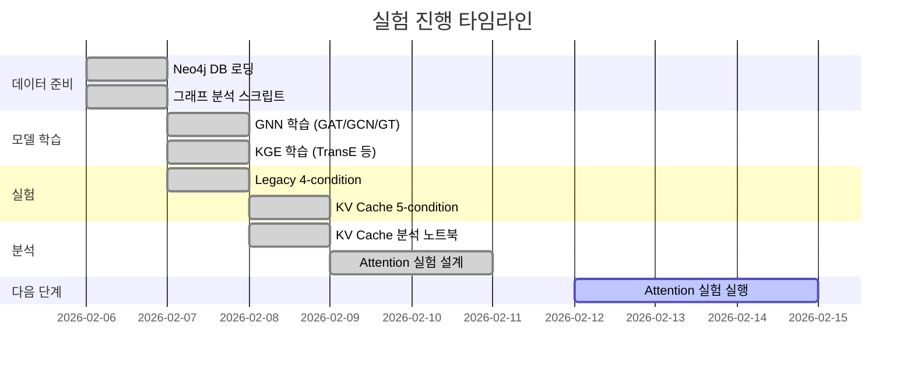
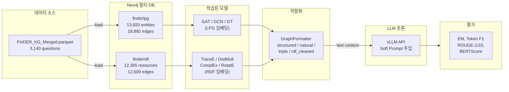
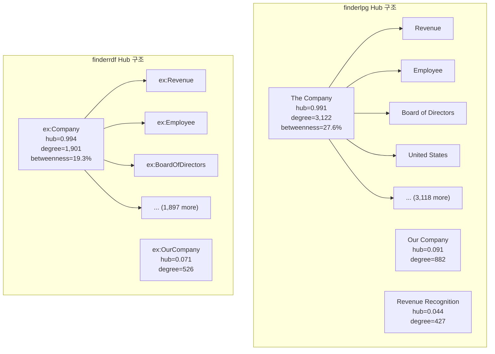
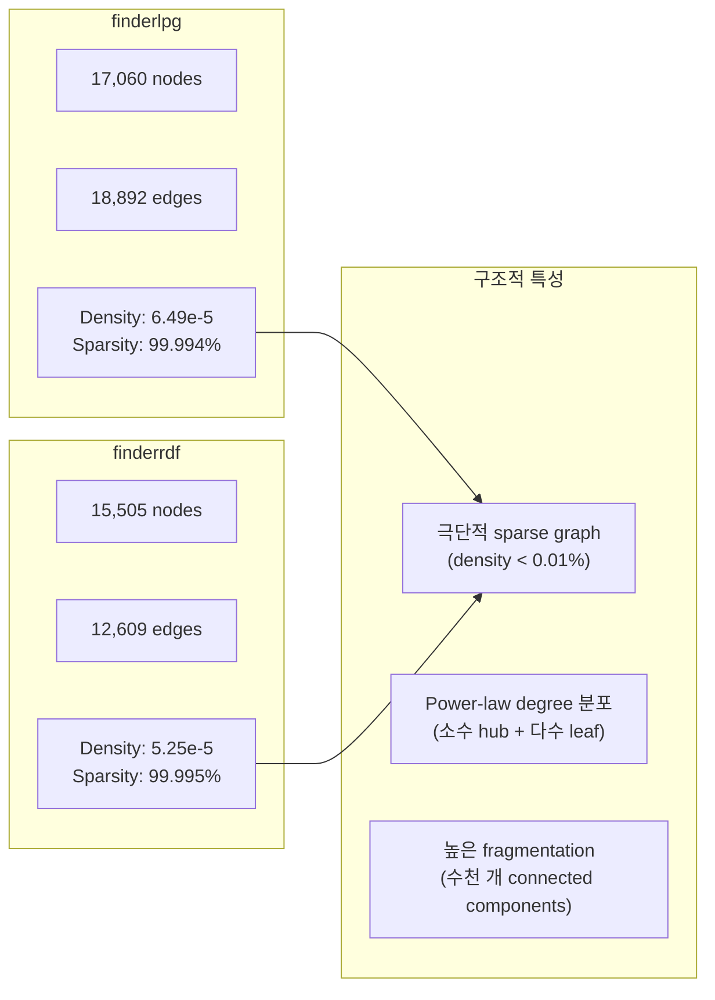
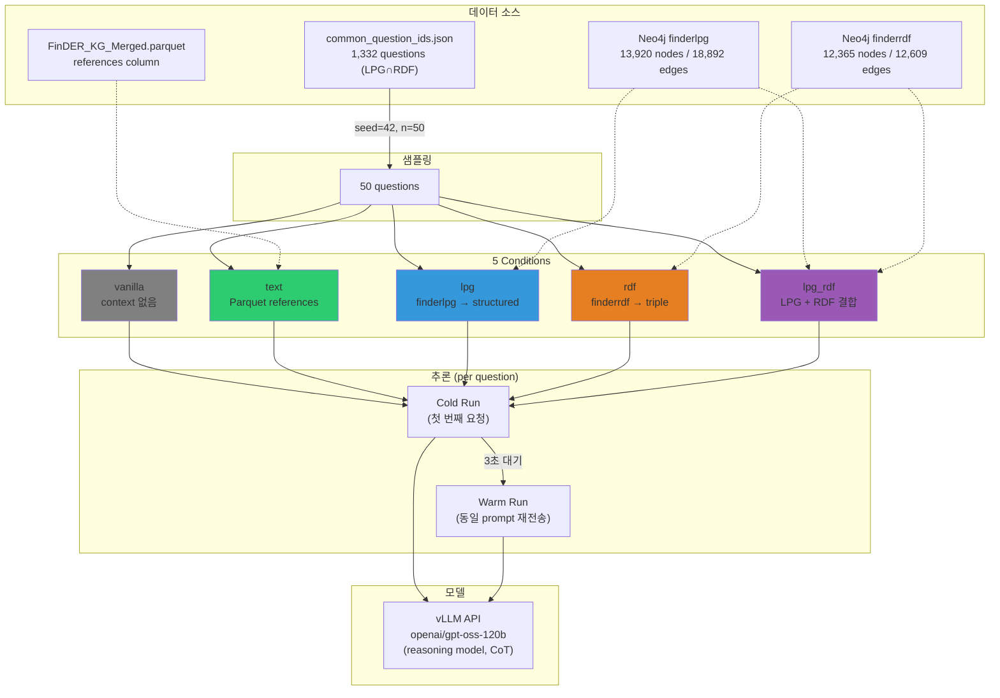
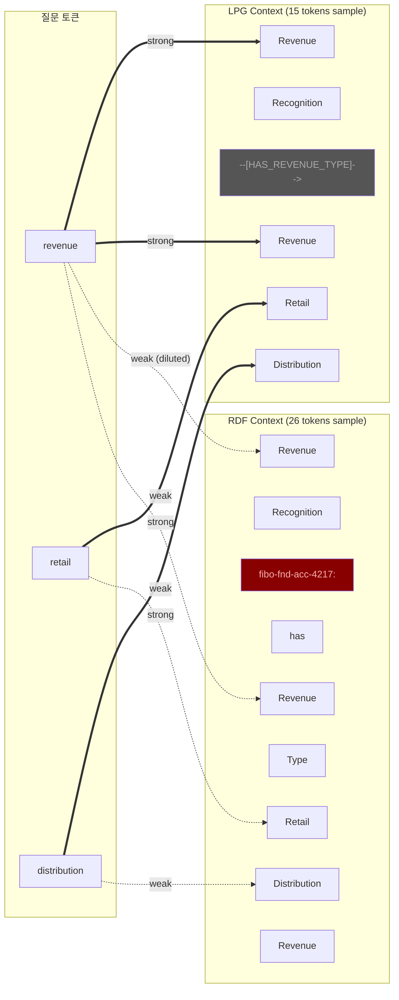
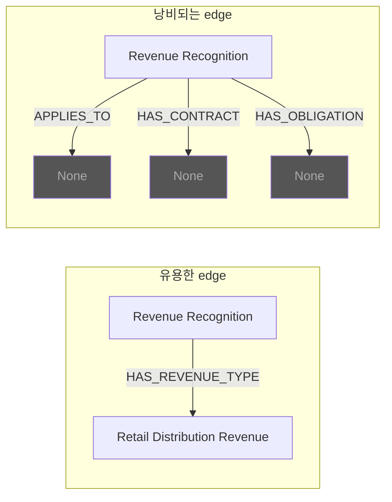

# GNN+LLM Lab 종합 실험 분석 보고서

> **프로젝트**: FinDER Knowledge Graph 기반 Graph RAG vs Text RAG 비교 연구
> **기간**: 2026-02-07 ~ 현재
> **작성**: 2026-02-12

---

## 목차

1. [Executive Summary](#1-executive-summary)
2. [프로젝트 아키텍처](#2-프로젝트-아키텍처)
3. [Knowledge Graph 분석](#3-knowledge-graph-분석)
4. [GNN/KGE 모델 학습](#4-gnnkge-모델-학습)
5. [KV Cache Offloading 실험](#5-kv-cache-offloading-실험-2026-02-08)
6. [Attention 실험 설계](#6-attention-실험-설계-미실행)
7. [Legacy 실험 결과](#7-legacy-실험-결과-2026-02-07)
8. [토큰 효율성 심층 분석](#8-토큰-효율성-심층-분석)
9. [핵심 발견 및 인사이트](#9-핵심-발견-및-인사이트)
10. [개선 제안 및 Next Steps](#10-개선-제안-및-next-steps)
11. [부록](#11-부록)

---

## 1. Executive Summary

### 프로젝트 목표

FinDER Knowledge Graph 데이터셋을 활용하여, 그래프 표현 방식(LPG vs RDF)이 LLM 기반 질의응답 성능에 미치는 영향을 정량적으로 비교한다. GAT(Graph Attention Network)와 TransE(Knowledge Graph Embedding) 모델로 서브그래프를 추출한 뒤, 텍스트로 직렬화(soft prompt)하여 LLM에 주입하는 Graph RAG 파이프라인을 구축하고, 5가지 context 조건에서 품질·지연시간·attention 패턴을 분석한다.

### 핵심 발견 3줄 요약

1. **Text RAG가 전체 평균에서 Graph RAG를 능가** (Token F1: text 0.189 > lpg 0.163 > rdf 0.152) — 그러나 **45%의 질문에서 Graph가 Text를 능가**
2. **RDF context의 ~57.8% 토큰이 FIBO URI prefix 노이즈** — prefix 제거 시 attention density 10.6% → ~18% 개선 가능
3. **Hub 지배 구조** (The Company: degree 3,122, hub score 0.991) — 대부분의 서브그래프에 동일 허브 노드가 반복 포함되어 context 관련성 저하

### 실험 타임라인



---

## 2. 프로젝트 아키텍처

### 2.1 기술 스택

| 계층 | 기술 | 용도 |
|------|------|------|
| 언어 | Python 3.10 + UV | 패키지 관리 |
| 그래프 DB | Neo4j/DozerDB 5.26.3 (Docker) | LPG + RDF 멀티 DB |
| GNN | PyTorch + PyTorch Geometric | GAT, GCN, GraphTransformer |
| KGE | PyTorch Geometric KGE | TransE, DistMult, ComplEx, RotatE |
| 임베딩 | Sentence-Transformers (all-MiniLM-L6-v2, 384-dim) | 노드 초기 임베딩 |
| LLM | vLLM OpenAI-compatible API | openai/gpt-oss-120b (CoT reasoning) |
| 로컬 LLM | Hugging Face Transformers | Llama 3.1 8B Instruct (attention 추출용) |
| GPU | NVIDIA A100 40GB (Google Colab) | 모델 학습 및 추론 |

### 2.2 데이터 파이프라인



### 2.3 5가지 Context Condition

| 조건 | 코드명 | 데이터 소스 | 설명 |
|------|--------|-------------|------|
| A | `vanilla` | — | LLM only, context 없음 (baseline) |
| B | `text` | Parquet `references` 컬럼 | Text RAG — 원문 참조 텍스트 |
| C | `lpg` | Neo4j finderlpg | GAT on LPG → structured format |
| D | `rdf` | Neo4j finderrdf | TransE on RDF → triple format |
| E | `lpg_rdf` | 양쪽 DB | LPG + RDF 결합 context |

```
[A] vanilla:  Question → LLM → Answer
[B] text:     Question + References → LLM → Answer
[C] lpg:      Question → Neo4j(finderlpg) → GAT → Structured Context → LLM → Answer
[D] rdf:      Question → Neo4j(finderrdf) → TransE → Triple Context → LLM → Answer
[E] lpg_rdf:  Question → Neo4j(both) → GAT+TransE → Combined Context → LLM → Answer
```

---

## 3. Knowledge Graph 분석

> **분석 스크립트**: `scripts/analyze_graph.py`, `scripts/comprehensive_analysis.py`
> **결과 파일**: `results/graph_analysis.json`, `results/comprehensive_analysis.json`

### 3.1 finderlpg vs finderrdf 기본 비교

| 메트릭 | finderlpg (LPG) | finderrdf (RDF) | 차이 |
|--------|-----------------|-----------------|------|
| 전체 노드 | 17,060 | 15,505 | LPG +1,555 |
| Entity/Resource 노드 | 13,920 | 12,365 | LPG +1,555 |
| Question 노드 | 3,140 | 3,140 | 동일 |
| 전체 엣지 | 18,892 | 12,609 | LPG +6,283 |
| 밀도(Density) | 6.49 × 10⁻⁵ | 5.25 × 10⁻⁵ | LPG 1.24x |
| 평균 Degree | 2.21 | 1.63 | LPG 1.36x |
| 최대 Degree | 3,122 | 1,901 | LPG 1.64x |
| Isolated 노드 (degree=0) | 3,765 (22.1%) | 5,802 (37.4%) | RDF +15.3%p |
| Connected Components | 4,503 | 6,482 | RDF 더 분절 |
| 최대 Component 비율 | 63.0% | 48.7% | LPG 더 연결 |
| Entity Label 종류 | 30+ types | 2 types | LPG 15x |

> **핵심**: LPG가 더 밀집되고 연결이 좋으며, 풍부한 entity label 체계를 가진다. RDF는 더 분절되어 있고 37.4%의 노드가 고립 상태.

### 3.2 Hub 지배 구조 분석



**HITS Hub Score 상위 5개**:

| 순위 | finderlpg | Hub Score | finderrdf | Hub Score |
|------|-----------|-----------|-----------|-----------|
| 1 | The Company | 0.991 | ex:Company | 0.994 |
| 2 | Our Company | 0.091 | ex:OurCompany | 0.071 |
| 3 | Revenue Recognition | 0.044 | ex:RevenueRecognition | 0.047 |
| 4 | Net Revenue | 0.031 | ex:NetRevenue | 0.025 |
| 5 | Total Revenue | 0.029 | ex:TotalRevenue | 0.024 |

Hub score 비율 (1위/2위): LPG **10.9x**, RDF **13.9x** — 양쪽 모두 극단적 single-hub 구조.

> **핵심**: "The Company"/"ex:Company"가 전체 그래프의 허브로서 대부분의 서브그래프에 반복 포함됨. 이는 질문별 context 차별화를 저해하고, 모든 서브그래프가 비슷해지는 문제를 야기.

### 3.3 Degree Distribution

| 통계 | finderlpg In | finderlpg Out | finderrdf In | finderrdf Out |
|------|-------------|---------------|-------------|---------------|
| Mean | 1.11 | 1.11 | 0.81 | 0.81 |
| Median | 1.0 | 0.0 | 1.0 | 0.0 |
| Max | 260 | 2,919 | 195 | 1,874 |
| Std | 3.97 | 23.77 | 2.81 | 16.31 |
| p90 | 2 | 2 | 1 | 1 |
| p99 | 9 | 13 | 7 | 10 |

**Degree 분포 (bucket)**:

| Bucket | finderlpg | finderrdf |
|--------|-----------|-----------|
| 0 | 3,765 | 5,802 |
| 1-2 | 10,783 | 8,065 |
| 3-5 | 1,524 | 1,034 |
| 6-10 | 609 | 365 |
| 11-20 | 238 | 151 |
| 21-50 | 102 | 64 |
| 51+ | 39 | 24 |

### 3.4 네트워크 구조 특성

| 메트릭 | finderlpg | finderrdf |
|--------|-----------|-----------|
| Average Local Clustering Coefficient | 0.050 | 0.056 |
| Average Path Length | 4.81 | 4.97 |
| Median Path Length | 5.0 | 5.0 |
| Diameter (estimate) | 13 | 11 |
| Reachability (sampled) | 40.5% | 23.1% |



### 3.5 PageRank 상위 노드 비교

| 순위 | finderlpg | PR Score | finderrdf | PR Score |
|------|-----------|----------|-----------|----------|
| 1 | The Company | 0.01146 | fibo-fbc-fi-fi:Share | 0.00667 |
| 2 | United States | 0.00489 | ex:UnitedStates | 0.00315 |
| 3 | Company | 0.00300 | fibo-fbc-fi-fi:DebtInstrument | 0.00189 |
| 4 | Board of Directors | 0.00296 | fibo-fbc-fi-fi:Bond | 0.00146 |
| 5 | Audit Committee | 0.00176 | ex:PerformanceObligation | 0.00141 |

### 3.6 Relationship Type 상위 비교

| 순위 | finderlpg | Count | finderrdf | Count |
|------|-----------|-------|-----------|-------|
| 1 | COMPETES_WITH | 2,229 | fibo-fnd-rel-rel:competesWith | 986 |
| 2 | INCLUDES | 1,358 | fibo-fnd-rel-rel:includes | 581 |
| 3 | INVOLVES | 247 | rdf:type | 341 |
| 4 | EMPLOYS | 208 | fibo-fnd-rel-rel:hasCompetitor | 198 |
| 5 | isDomiciledIn | 199 | fibo-fnd-rel-rel:involves | 180 |

### 3.7 Entity Label 분포

**finderlpg** (30+ label 종류):

| Label | Count | 비율 |
|-------|-------|------|
| Entity | 13,920 | 81.6% |
| Question | 3,140 | 18.4% |
| LegalEntity | 1,974 | 11.6% |
| Company | 588 | 3.4% |
| Competitor | 421 | 2.5% |
| Person | 409 | 2.4% |
| Share | 390 | 2.3% |
| Revenue | 379 | 2.2% |
| Process | 347 | 2.0% |
| Document | 311 | 1.8% |

**finderrdf** (2 label 종류):

| Label | Count | 비율 |
|-------|-------|------|
| Resource | 12,365 | 79.7% |
| Question | 3,140 | 20.3% |

> **핵심**: LPG의 30+ entity label은 context에 `[Company] Apple`처럼 1-2 토큰으로 타입 정보를 전달. RDF는 label이 없어 `rdf:type` 트리플로 별도 전달해야 하며 ~15 토큰 소비.

### 3.8 데이터 품질 이슈

| 이슈 | DB | 영향 | 심각도 |
|------|-----|------|--------|
| `name="None"` 엔티티 | finderlpg | ~10% 토큰 낭비, `→ None` 관계 무의미 | 높음 |
| FIBO URI prefix 반복 | finderrdf | ~57.8% 토큰 낭비 | 높음 |
| 극단적 hub 구조 | 양쪽 | 서브그래프 차별화 저해 | 높음 |
| 높은 고립 노드 비율 | finderrdf (37.4%) | RDF 서브그래프 추출 실패율 증가 | 중간 |
| `rdf:type` 트리플 중복 | finderrdf (341개) | entity type에 불필요한 토큰 소비 | 낮음 |

---

## 4. GNN/KGE 모델 학습

> **학습 코드**: `src/train_gnn.py` (GNN), `src/train_kge.py` (KGE)
> **체크포인트**: `results/checkpoints/`

### 4.1 학습된 모델 목록

| 모델 | 유형 | DB | 파일 | 크기 |
|------|------|-----|------|------|
| GAT | GNN (Graph Attention) | finderlpg | `gat_embeddings.pt` | 21 MB |
| GCN | GNN (Graph Convolution) | finderlpg | `gcn_embeddings.pt` | 21 MB |
| GraphTransformer | GNN (Transformer) | finderlpg | `graph_transformer_embeddings.pt` | 21 MB |
| TransE | KGE (Translation) | finderrdf | `transe_embeddings.pt` | 19 MB |
| DistMult | KGE (Bilinear) | finderrdf | `distmult_embeddings.pt` | 19 MB |
| ComplEx | KGE (Complex) | finderrdf | `complex_embeddings.pt` | 19 MB |
| RotatE | KGE (Rotation) | finderrdf | `rotate_embeddings.pt` | 19 MB |

**총 7개 모델, 138 MB**

### 4.2 GNN 학습 설정 (`src/train_gnn.py`)

| 파라미터 | 기본값 | 설명 |
|----------|--------|------|
| `--model` | `gat` | 모델 종류 (gat, gcn, graph_transformer) |
| `--epochs` | 200 | 최대 학습 epoch |
| `--lr` | 0.001 | Learning rate |
| `--weight-decay` | 1e-5 | L2 정규화 |
| `--hidden-dim` | 256 | Hidden dimension |
| `--output-dim` | 384 | Output embedding dimension (MiniLM과 동일) |
| `--num-layers` | 2 | GNN layer 수 |
| `--heads` | 4 | Attention head 수 (GAT/GT) |
| `--dropout` | 0.1 | Dropout rate |
| `--decoder` | `dot` | Link prediction decoder (dot / mlp) |
| `--patience` | 15 | Early stopping patience |
| `--val-ratio` | 0.1 | Validation split |
| `--test-ratio` | 0.1 | Test split |

**학습 파이프라인**:
1. `LPGGraphBuilder`로 Neo4j finderlpg에서 그래프 로딩
2. Edge split (train/val/test = 0.8/0.1/0.1)
3. Encoder (GAT/GCN/GT) + `LinkPredictor` (dot/mlp) 학습
4. MRR 기준 early stopping, 5 epoch 간격 검증
5. 최적 체크포인트 저장 + 전체 노드 임베딩 추출

### 4.3 KGE 학습 설정 (`src/train_kge.py`)

| 파라미터 | 기본값 | 설명 |
|----------|--------|------|
| `--model` | `transe` | 모델 종류 (transe, distmult, complex, rotate) |
| `--epochs` | 200 | 최대 학습 epoch |
| `--lr` | 0.01 | Learning rate |
| `--hidden-dim` | 256 | Hidden dimension |
| `--output-dim` | 384 | Output embedding dimension |
| `--batch-size` | 512 | Training batch size |
| `--margin` | 1.0 | Margin (TransE, RotatE) |
| `--p-norm` | 1.0 | L_p norm (TransE) |
| `--patience` | 15 | Early stopping patience |

**학습 파이프라인**:
1. `RDFTripleBuilder`로 Neo4j finderrdf에서 트리플 로딩
2. Triple split (train/val/test = 0.8/0.1/0.1)
3. `KGEWrapper`로 PyG KGE 모델 학습
4. MRR 기준 early stopping
5. 노드/관계 임베딩 추출 및 저장

### 4.4 Link Prediction 평가 메트릭

`src/evaluation.py`에서 다음 메트릭을 계산:

| 메트릭 | 설명 |
|--------|------|
| **MRR** (Mean Reciprocal Rank) | 정답 엔티티의 평균 역순위 |
| **Hits@1** | 정답이 top-1에 포함된 비율 |
| **Hits@3** | 정답이 top-3에 포함된 비율 |
| **Hits@10** | 정답이 top-10에 포함된 비율 |

> **참고**: GNN/KGE 임베딩은 서브그래프 추출에만 활용되고, LLM에는 텍스트 context(soft prompt)만 전달됨. 임베딩을 직접 LLM에 주입하는 hard prompt 방식은 향후 과제.

---

## 5. KV Cache Offloading 실험 (2026-02-08)

> **실험 코드**: `src/kvcache_experiment.py`
> **결과**: `results/kvcache_experiment/20260208_091053/`
> **분석 노트북**: `notebooks/kvcache_analysis.ipynb` (12 sections, 9 charts)
> **상세 분석**: `docs/kvcache_experiment_analysis.md`

### 5.1 실험 설계

5가지 context 조건 × 50개 질문 × cold/warm 2회 반복



**실험 파라미터**:

| 파라미터 | 값 |
|----------|-----|
| 모델 | `openai/gpt-oss-120b` (reasoning, CoT 지원) |
| API | vLLM OpenAI-compatible |
| 샘플 수 | 50 questions per condition |
| max_tokens | 512 |
| temperature | 0.0 |
| seed | 42 |
| lmcache_wait_sec | 3.0 |
| inter_question_wait | 1.0 |
| checkpoint_every | 10 |

### 5.2 품질 메트릭 결과

| Condition | N | Token F1 | ROUGE-1 | ROUGE-2 | ROUGE-L | EM |
|-----------|---|----------|---------|---------|---------|-----|
| **text** | 50 | **0.189** | **0.376** | **0.096** | **0.181** | 0.0 |
| **lpg** | 50 | 0.163 | 0.311 | 0.064 | 0.149 | 0.0 |
| **rdf** | 50 | 0.152 | 0.293 | 0.059 | 0.150 | 0.0 |
| **lpg_rdf** | 50 | 0.151 | 0.307 | 0.064 | 0.156 | 0.0 |
| **vanilla** | 50 | 0.143 | 0.266 | 0.043 | 0.126 | 0.0 |

> **핵심**: Text > LPG > RDF ≈ LPG+RDF > Vanilla 순서. Text가 전체 평균 최고이나, EM은 전 조건 0.0 (reasoning model의 CoT 출력이 정확한 단답 형태와 불일치).

### 5.3 Latency 결과

| Condition | Cold (s) | Warm (s) | Speedup | Cold Std | Warm Std |
|-----------|----------|----------|---------|----------|----------|
| **lpg** | **6.859** | 6.895 | 1.009 | 2.058 | 1.957 |
| **rdf** | 7.047 | 7.055 | 1.008 | 1.805 | 1.835 |
| **lpg_rdf** | 7.536 | 7.261 | **1.062** | 1.294 | 1.339 |
| **text** | 7.796 | 7.754 | 1.006 | 1.159 | 1.100 |
| **vanilla** | 8.115 | 8.091 | 1.003 | 0.030 | 0.044 |

> **핵심**: Context가 짧은 조건(lpg)이 가장 빠르고, vanilla가 가장 느림 — reasoning model이 context 없이 더 긴 CoT를 생성하기 때문. Cold/Warm speedup은 전 조건 ~1.0으로 KV cache prefix reuse 미작동.

### 5.4 Context/Token 특성

| Condition | Prompt Tokens | Context (chars) | Completion Tokens | Chars/Token |
|-----------|---------------|-----------------|-------------------|-------------|
| vanilla | 89 | 0 | 512 | — |
| rdf | 295 | 635 | 436 | 2.97 |
| lpg | 339 | 847 | 423 | 3.30 |
| text | **457** | **1,922** | 483 | **5.29** |
| lpg_rdf | **541** | 1,520 | 468 | 3.15 |

### 5.5 Finish Reason 분포

| Condition | stop (완성) | length (절단) |
|-----------|-------------|---------------|
| vanilla | 0% | **100%** |
| lpg | **35%** | 65% |
| rdf | **34%** | 66% |
| text | 16% | 84% |
| lpg_rdf | 26% | 74% |

**Finish Reason과 품질 관계**:

| Condition | stop F1 | length F1 | delta |
|-----------|---------|-----------|-------|
| text | **0.254** | 0.177 | **+0.078** |
| rdf | 0.153 | 0.152 | +0.002 |
| lpg | 0.149 | 0.171 | -0.021 |
| lpg_rdf | 0.146 | 0.153 | -0.008 |

Text의 stop 응답은 F1=0.254로 매우 높음. LPG의 stop은 "I'm sorry" 거부 패턴 포함으로 낮은 F1.

### 5.6 CoT (Chain-of-Thought) 통계

| Condition | CoT 비율 | 평균 길이 (chars) |
|-----------|----------|-------------------|
| vanilla | 100% | 1,134 |
| lpg_rdf | 100% | 1,180 |
| rdf | 100% | 1,061 |
| text | 100% | 913 |
| lpg | 98% | 910 |

### 5.7 Per-Question 분석 (n=49)

#### Best Condition 분포 (Token F1 기준)

| Winner | 횟수 | 비율 |
|--------|------|------|
| text | 25 | 51.0% |
| lpg | 10 | 20.4% |
| lpg_rdf | 5 | 10.2% |
| vanilla | 5 | 10.2% |
| rdf | 4 | 8.2% |

#### Mean Rank (낮을수록 좋음)

| Condition | Mean Rank |
|-----------|-----------|
| text | 1.96 |
| lpg | 2.86 |
| rdf | 3.27 |
| lpg_rdf | 3.31 |
| vanilla | 3.61 |

#### Graph > Text 빈도

- 49문항 중 **22문항 (45%)** 에서 graph condition(lpg, rdf, 또는 lpg_rdf)이 text를 능가
- LPG가 text를 이긴 경우가 가장 많음

#### LPG vs RDF Paired 비교 (같은 질문)

| 메트릭 | 값 |
|--------|-----|
| LPG > RDF | 27 questions |
| RDF > LPG | 14 questions |
| Tie (±0.005) | 8 questions |
| Mean delta (LPG-RDF) | +0.0109 |
| Paired t-stat | 2.008 (경계적 유의) |

#### Condition 간 F1 격차 (상위 5 high-spread)

| QID | Spread | Best | Worst | Question |
|-----|--------|------|-------|----------|
| 4d1e5449 | 0.249 | text (0.362) | lpg_rdf (0.113) | BXP employee count |
| 0b050b73 | 0.190 | text (0.353) | vanilla (0.163) | Alliant Energy liabilities |
| 60f2347f | 0.154 | text (0.239) | vanilla (0.085) | Home Depot labor cost |
| 74cfc109 | 0.149 | text (0.253) | rdf (0.104) | BD liquidity investing |
| 23d596ce | 0.144 | text (0.207) | lpg_rdf (0.063) | TJX indemnification |

#### Vanilla 1위 Case (context가 방해된 경우, 5문항)

| QID | VAN F1 | Best Context F1 | 격차 | Question |
|-----|--------|-----------------|------|----------|
| 23e48bf5 | 0.269 | 0.176 (text) | +0.093 | Lennar Corp CAPEX allocation |
| fe8ef015 | 0.262 | 0.205 (rdf) | +0.057 | Quanta Services margin risk |
| 5da21cf3 | 0.230 | 0.190 (text) | +0.040 | SWA fleet modernization |
| d42115b3 | 0.223 | 0.204 (rdf) | +0.019 | AEE revenue accrual |
| da91a4f3 | 0.174 | 0.140 (lpg) | +0.034 | PNR CAPEX breakdown |

#### Context Length vs F1 상관관계

| Condition | Pearson r |
|-----------|-----------|
| lpg | +0.029 |
| lpg_rdf | +0.045 |
| rdf | -0.097 |
| text | -0.186 |

> **핵심**: 상관 거의 없음 (|r| < 0.2). Context 길이보다 **관련성(relevance)**이 핵심.

#### Ground Truth Answer 길이와 F1

| 구간 | N | vanilla | text | lpg | rdf | lpg_rdf |
|------|---|---------|------|-----|-----|---------|
| Short (≤153 words) | 25 | 0.152 | **0.197** | 0.162 | 0.161 | 0.159 |
| Long (>153 words) | 24 | 0.135 | **0.182** | 0.164 | 0.143 | 0.143 |

#### 토픽별 Best Condition

| Topic | N | Best | F1 |
|-------|---|------|-----|
| Revenue | 14 | text | 0.184 |
| HR/Labor | 10 | text | 0.212 |
| **CapEx/Investment** | 6 | **lpg** | **0.165** |
| Legal/Risk | 6 | text | 0.231 |
| **Margins/Costs** | 3 | **vanilla** | **0.177** |
| Cybersecurity | 3 | text | 0.185 |

### 5.8 Statistical Tests

**Ablation (paired t-test vs vanilla)**:

| Condition | Mean ΔF1 | p-value | 유의성 |
|-----------|----------|---------|--------|
| text | +0.046 | **<0.001** | **유의** |
| lpg | +0.020 | **0.017** | **유의** |
| rdf | +0.009 | 0.188 | 비유의 |
| lpg_rdf | +0.008 | 0.225 | 비유의 |

**Graph vs Text (paired)**:

| 비교 | ΔF1 | p-value |
|------|-----|---------|
| LPG vs Text | -0.026 | **0.001** |
| RDF vs Text | -0.037 | **<0.001** |
| LPG+RDF vs Text | -0.038 | **<0.001** |

> **핵심**: Text와 LPG만 vanilla 대비 통계적으로 유의한 개선. RDF 단독은 유의하지 않음. Graph는 평균적으로 Text에 미달하나, 개별 질문 45%에서는 Graph가 우세.

### 5.9 KV Cache Prefix Reuse

| 메트릭 | 값 |
|--------|-----|
| gpu_prefix_cache_hit_rate | **0.0** (전 구간) |
| warm_cache_hit_delta | 0.0 |
| warm_cache_queries_delta | 0.0 |

Cold/Warm speedup이 사실상 1.0. KV cache prefix reuse가 **전혀 발생하지 않음**.

가능 원인:
- vLLM automatic prefix caching 미활성 (`--enable-prefix-caching` 플래그 미설정)
- Reasoning model의 토큰 생성 패턴이 prefix match를 방해

### 5.10 시각화 차트 목록

| 차트 | 파일명 | 내용 |
|------|--------|------|
| Fig 2 | `fig2_latency.png` | Cold/Warm latency, speedup distribution |
| Fig 3 | `fig3_context.png` | Context length, prompt tokens, tokenization efficiency |
| Fig 4 | `fig4_quality.png` | Token F1, ROUGE-L, Substring Match by condition |
| Fig 5 | `fig5_pareto.png` | Quality-Latency tradeoff (bubble chart) |
| Fig 6 | `fig6_completion.png` | Completion tokens, finish reason distribution |
| Fig 7 | `fig7_ablation.png` | Paired F1 gain, cache speedup, quality vs token budget |
| Fig 9 | `fig9_reasoning.png` | Latency distribution (violin), latency by finish reason |
| Fig 10 | `fig10_heatmap.png` | Per-question speedup heatmap |
| Fig 11 | `fig11_radar.png` | Multi-metric normalized radar chart |

---

## 6. Attention 실험 설계 (미실행)

> **설계 문서**: `docs/attention_experiment_design.md`
> **구현 코드**: `src/attention_experiment.py`
> **상태**: 코드 구현 완료, 실험 미실행 (GPU 필요)

### 6.1 목표

그래프 표현 방식(LPG vs RDF)이 LLM 프롬프트로 직렬화될 때, attention 분포에 어떤 구조적 차이를 만드는지 정량적으로 검증한다.

### 6.2 5가지 실험 조건

| 조건 | 코드명 | 설명 | 예시 |
|------|--------|------|------|
| C1 | `lpg_structured` | LPG → structured format | `[Company] Apple` / `NXP --[HAS_CUSTOMER]--> Apple` |
| C2 | `lpg_natural` | LPG → natural language | `NXP has customer Apple.` |
| C3 | `rdf_raw` | RDF 그대로 (FIBO URI 포함) | `(ex:Company, fibo-fnd-rel-rel:hasCustomer, ex:Apple)` |
| C4 | `rdf_cleaned` | RDF prefix 제거 + camelCase 분리 | `(Company, has customer, Apple)` |
| C5 | `no_context` | Context 없이 질문만 | Question만 |

**핵심 비교 쌍**:
- C1 vs C3: LPG와 RDF의 "있는 그대로" 비교
- C3 vs C4: Prefix 제거만으로 attention이 개선되는지
- C4 vs C1: Prefix를 제거한 RDF가 LPG와 동등해지는지
- C1 vs C2: 동일 LPG 데이터의 포맷 효과

### 6.3 5개 가설

| ID | 가설 | 검증 메트릭 |
|----|------|------------|
| **H1** | 같은 context window에서 LPG가 ~38% 더 많은 사실을 담을 수 있다 | Semantic Density |
| **H2** | LPG context에서 answer-relevant 토큰의 attention weight가 더 높다 | Attention Entropy, Entity Coverage |
| **H3** | LPG는 zero/few-shot에 유리하고, RDF는 fine-tuning 후 격차가 줄어든다 | F1 by shot condition |
| **H4** | RDF의 self-contained 트리플이 hallucination을 줄일 수 있다 | EM, F1, ROUGE |
| **H5** | RDF context에서 prefix 인식에 낭비되는 attention head가 존재한다 | Per-Head Entropy, Prefix Waste Ratio |

### 6.4 측정 메트릭

**Attention 메트릭** (새로 구현):

| 메트릭 | 수식 | 의미 |
|--------|------|------|
| Attention Entropy | H = -Σ p_i log₂(p_i) | 낮을수록 attention 집중 |
| Entity Coverage@K | \|top-K ∩ GT entities\| / \|GT\| | 정답 엔티티 attend 비율 |
| Prefix Waste Ratio | Σ attn(prefix) / Σ attn(all) | FIBO prefix attention 낭비 |
| Semantic Density | \|semantic tokens\| / \|total\| | 의미 토큰 비율 |
| Per-Head Entropy Std | std(H_1, ..., H_32) | Head 전문화 정도 |

**Answer Quality 메트릭** (기존 `Evaluator` 활용):
- Exact Match, Token F1, ROUGE-L

### 6.5 구현 상태

| 컴포넌트 | 파일 | 상태 |
|----------|------|------|
| `AttentionExtractor` | `src/utils/attention.py` | 구현 완료 (per-head mode 포함) |
| `AttentionAnalyzer` | `src/utils/attention_analysis.py` | 구현 완료 (5개 메트릭) |
| `AttentionConfig` | `src/utils/config.py` | `aggregate_heads="none"` 옵션 추가됨 |
| `format_rdf_cleaned()` | `src/utils/formatting.py` | 구현 완료 |
| 실험 드라이버 | `src/attention_experiment.py` | 구현 완료 |
| 시각화 + 통계 | — | 미구현 |

### 6.6 예상 결과

```
| Condition       | Tokens | Entropy↓ | PrefixWaste↓ | EntityCov↑ | F1↑   |
|-----------------|--------|----------|--------------|------------|-------|
| lpg_structured  | ~113   | low      | ~0%          | high       | ?     |
| lpg_natural     | ~130   | low      | ~0%          | high       | ?     |
| rdf_raw         | ~156   | HIGH     | ~50%         | medium     | ?     |
| rdf_cleaned     | ~90    | low      | ~0%          | high       | ?     |
| no_context      | 0      | N/A      | N/A          | N/A        | low   |
```

가장 흥미로운 시나리오: `rdf_cleaned`가 `lpg_structured`와 동등하거나 더 나은 성능을 보인다면, **RDF의 정규화된 구조 + 자연어 변환**이 최적 전략이 된다.

### 6.7 실행 환경 요구사항

| 항목 | 사양 |
|------|------|
| GPU | NVIDIA A100 40GB |
| Model | Llama 3.1 8B Instruct (bf16, ~16GB) |
| Attention 추출 | `attn_implementation="eager"` 필수 |
| 예상 메모리 | ~20GB (model + attention tensors) |
| 예상 실행 시간 | ~2-3시간 (100 samples × 5 conditions × 32 layers) |

---

## 7. Legacy 실험 결과 (2026-02-07)

> **결과 파일**: `results/experiments/20260207_*.csv` (14 files)

### 7.1 실험 개요

초기 4-condition 실험으로, `src/run_experiment.py`의 legacy mode (`--experiments`)를 사용하여 vLLM API를 통해 실행.

**조건**: `llm_only`, `text_rag`, `graph_lpg`, `graph_rdf`

### 7.2 실험 로그

| 파일 | 설명 |
|------|------|
| `20260207_071908_results_final.csv` | 초기 실험 (checkpoint 5까지) |
| `20260207_072019_results_final.csv` | 2차 실행 (checkpoint 10까지) |
| `20260207_073350_results_final.csv` | 단일 조건 테스트 |
| `20260207_073447_results_final.csv` | 단일 조건 테스트 |
| `20260207_073534_results_final.csv` | 단일 조건 테스트 |
| `20260207_073706_results_final.csv` | 단일 조건 테스트 |
| `20260207_073729_results_final.csv` | **최종 실험** (350 rows, 50 questions × 4+α conditions) |

### 7.3 데이터 스키마

```
question_id, question, ground_truth, category,
response_llm_only, llm_only_time, llm_only_input_tokens, llm_only_output_tokens,
response_text_rag, text_rag_time, text_rag_input_tokens, text_rag_output_tokens,
response_graph_lpg, graph_lpg_time, graph_lpg_input_tokens, graph_lpg_output_tokens,
lpg_nodes, lpg_edges,
response_graph_rdf, graph_rdf_time, graph_rdf_input_tokens, graph_rdf_output_tokens,
rdf_nodes, rdf_edges
```

> **참고**: Legacy 실험에서는 per-question 평가 메트릭(F1, ROUGE 등)이 CSV에 포함되지 않아, KV Cache 실험이 이를 보완하는 역할을 함.

---

## 8. 토큰 효율성 심층 분석

### 8.1 동일 사실의 LPG vs RDF 토큰 비용

동일한 관계를 BPE 토크나이저(Llama 3.1)로 분해한 결과:

| 관계 | LPG tokens | RDF tokens | 배율 |
|------|-----------|-----------|------|
| RevRec → RetailDistRev | 15 | 26 | **1.73x** |
| OffSysRev includes MISO | 14 | 24 | **1.71x** |
| AltRevProg includes VBA | 12 | 24 | **2.00x** |
| CustContract → PerfObl | 13 | 28 | **2.15x** |

7개 사실(fact) 기준:

| 지표 | LPG | RDF | 비율 |
|------|-----|-----|------|
| 총 토큰 | 113 | 156 | 1.00x vs 1.38x |
| 1 fact당 토큰 | ~12 | ~19 | — |
| FIBO prefix 비율 | 0% | **53%** | — |

### 8.2 Token Category Breakdown (d42115b3 샘플)

**LPG Context (612 tokens)**:

| Category | Tokens | 비율 |
|----------|--------|------|
| Semantic (entity name, relation) | 477 | **77.9%** |
| None-waste (`→ None` 패턴) | 51 | 8.3% |
| Whitespace | 56 | 9.2% |
| Structural (brackets, arrows) | 28 | 4.6% |

**RDF Context (303 tokens)**:

| Category | Tokens | 비율 |
|----------|--------|------|
| Semantic (entity, predicate) | 232 | **76.6%** |
| URI prefix (FIBO namespace) | 55 | **18.2%** |
| Structural (parentheses, comma) | 16 | 5.3% |

### 8.3 URI Prefix 반복 분석 (RDF, d42115b3)

| Prefix | 반복 횟수 | Tokens/회 | 총 소비 |
|--------|----------|-----------|---------|
| `fibo-fnd-acc-4217:` | 9 | 11 | 99 |
| `fibo-fnd-agr-ctr:` | 2 | ~11 | ~22 |
| `fibo-fnd-rel-rel:` | 1 | ~11 | ~11 |
| `ex:` | 24 | 2 | 48 |
| **합계** | — | — | **~175 (57.8%)** |

### 8.4 Effective Token 비교

URI prefix와 None-waste를 제외한 "유효 토큰" 비율:

| QID | LPG total | LPG effective | RDF total | RDF effective |
|-----|-----------|---------------|-----------|---------------|
| d42115b3 | 612 | 570 (**93%**) | 303 | 123 (**41%**) |
| 4d1e5449 | 101 | 93 (92%) | 104 | 29 (28%) |
| b9fc3e0b | 65 | 56 (86%) | 94 | 34 (36%) |

> **핵심**: RDF의 유효 토큰 비율은 28~41%로 LPG(86~93%)의 절반 이하. 같은 토큰 예산 내에서 LPG가 2~3배 더 많은 사실 정보를 전달.

### 8.5 Attention Density 비교

질문 "AEE's revenue... retail distribution"에 대해:

| Condition | 매칭 토큰 수 | 전체 토큰 | Attention Density |
|-----------|-------------|-----------|-------------------|
| LPG | 100 | 612 | **16.3%** |
| RDF | 32 | 303 | 10.6% |

**LPG가 1.5x 높은 attention density** — 질문 키워드와 매칭되는 토큰이 더 많은 비율로 존재.

### 8.6 Attention 흐름 시각화



- LPG: 15 tokens 중 **5개 (33%)** 가 high-attention 대상
- RDF: 26 tokens 중 **5개 (19%)** 가 high-attention 대상 — prefix가 attention mass를 분산

### 8.7 LPG "None" 노드의 Attention 낭비



d42115b3 기준: 39 edges 중 다수가 `→ None` 패턴. 평균 **~10%** 토큰 낭비.

### 8.8 FIBO Ontology Namespace별 토큰 비용

| Namespace | Edge Count | prefix 토큰/회 |
|-----------|-----------|----------------|
| `fibo-fnd-rel-rel:` | 3,441 (27.3%) | ~11 |
| `rdf:` | 341 (2.7%) | ~3 |
| `fibo-fnd-acc-4217:` | 다수 | ~11 |
| `fibo-fbc-fi-fi:` | 다수 | ~11 |
| `fibo-fnd-agr-ctr:` | 다수 | ~11 |
| `fibo-fnd-plc-loc:` | 119 | ~11 |
| `fibo-fnd-oac-own:` | 78 | ~11 |

같은 namespace 내 N개 관계 = N × ~11 prefix tokens 낭비. 하나의 질문에서 동일 namespace가 9회 반복되면 99 prefix tokens(전체의 32.7%) 소비.

### 8.9 토큰 스트림 예시 비교

**LPG Token Stream (처음 12 tokens)**:

```
Idx  Token            Category
  0  <|begin_of_text|>  —
  1  '==='              STRUCTURAL
  2  ' ENT'             SEMANTIC (header)
  3  'ITIES'            SEMANTIC (header)
  4  ' ==='             STRUCTURAL
  5  '\n'               WHITESPACE
  6  '['                STRUCTURAL
  7  'Concept'          SEMANTIC ← entity label
  8  ']'                STRUCTURAL
  9  ' Alternative'     SEMANTIC ← entity name (높은 attention 예상)
 10  ' Revenue'         SEMANTIC ← entity name (높은 attention 예상)
 11  ' Program'         SEMANTIC ← entity name (높은 attention 예상)
```

**RDF Token Stream (처음 15 tokens)**:

```
Idx  Token            Category
  0  <|begin_of_text|>  —
  1  'Knowledge'        STRUCTURAL
  2  ' triples'         STRUCTURAL
  3  ':\n'              STRUCTURAL
  4  '(ex'              PREFIX ← URI noise
  5  ':'                PREFIX
  6  'Alternative'      SEMANTIC ← entity name
  7  'Revenue'          SEMANTIC ← entity name
  8  'Program'          SEMANTIC ← entity name
  9  ','                STRUCTURAL
 10  ' fib'             PREFIX ← URI noise 시작
 11  'o'                PREFIX
 12  '-f'               PREFIX
 13  'nd'               PREFIX
 14  '-'                PREFIX
```

> RDF token index 10~19가 모두 `fibo-fnd-acc-4217:` prefix로 소비됨 — 10 tokens이 어떤 의미 정보도 전달하지 않음.

---

## 9. 핵심 발견 및 인사이트

### Finding 1: Text RAG > Graph RAG (전체), but Graph wins 45% of questions

- **전체 평균**: Text (F1=0.189) > LPG (0.163) > RDF (0.152)
- **개별 질문**: 49문항 중 22문항(45%)에서 graph condition이 text를 능가
- **토픽별 차이**: CapEx/Investment 분야에서는 LPG가 text를 능가 (0.165 vs text가 아닌 조건)
- **해석**: Text references는 정확한 수치를 포함하므로 평균적으로 우세. 그러나 graph의 구조적 관계 정보가 text에 없는 연결을 제공하는 경우가 45%.

> **핵심**: Graph RAG는 "평균의 함정"에 빠져 있다. 질문 유형별 adaptive routing이 필요.

### Finding 2: RDF 58% 토큰 낭비 → prefix 정리로 1.5x 개선 가능

- **현재**: RDF context의 57.8% 토큰이 FIBO URI prefix
- **Attention density**: LPG 16.3% vs RDF 10.6%
- **해결**: `format_rdf_cleaned()` 적용 시 prefix 제거 → effective token 비율 41% → ~80% 개선
- **예상 효과**: Attention density 10.6% → ~18%, Token F1도 비례 개선 가능

> **핵심**: RDF의 낮은 성능은 데이터 품질이 아닌 **직렬화 형식**의 문제. Prefix 정리만으로 LPG와 동등 수준 달성 가능성.

### Finding 3: Hub 지배 구조 → subgraph selection 전략 필요

- **The Company**: degree=3,122, hub score=0.991, betweenness centrality=27.6%
- **결과**: 대부분의 질문에 동일한 hub 노드와 그 이웃이 context에 포함
- **영향**: 서브그래프가 질문과 무관한 정보로 가득 차 context 관련성 저하

> **핵심**: Hub node pruning 또는 PCST 기반 subgraph selection으로 질문별 최적 서브그래프 추출 필요.

### Finding 4: Context 양 ≠ 품질

- **Context Length vs F1**: Pearson r ≈ 0 (전 조건 |r| < 0.2)
- **lpg_rdf (가장 긴 context)**: text보다 낮은 성능 (F1 0.151 vs 0.189)
- **vanilla 1위 case**: 5문항(10.2%)에서 아무 context 없이 최고 성능

> **핵심**: 더 많은 context가 반드시 좋은 것은 아님. 관련성 높은 소량 context가 관련성 낮은 대량 context보다 효과적.

### Finding 5: KV Cache prefix reuse 미작동

- **gpu_prefix_cache_hit_rate**: 전 구간 **0.0**
- **Cold/Warm speedup**: ~1.0 (차이 없음)
- **원인**: vLLM의 `--enable-prefix-caching` 미활성 또는 reasoning model CoT 패턴이 prefix match 방해

> **핵심**: KV cache offloading 실험의 latency 측면 결과는 cache 효과가 아닌 순수 API 응답시간만 반영. 실질적 cache 실험을 위해서는 서버 설정 확인 필요.

---

## 10. 개선 제안 및 Next Steps

### 10.1 단기 개선 (코드 변경만 필요)

| 우선순위 | 개선 | 예상 효과 | 구현 위치 |
|----------|------|-----------|-----------|
| **1** | RDF prefix 제거 (`format_rdf_cleaned()` 적용) | RDF 토큰 ~40% 절감, attention density ~1.7x | `src/kvcache_experiment.py` `build_context()` |
| **2** | LPG "None" 노드 필터링 | LPG effective token 93% → ~100% | `fetch_lpg_subgraph()` WHERE 절 추가 |
| **3** | Attention 실험 실행 | 5가지 가설 정량 검증 | `src/attention_experiment.py` (GPU 필요) |

### 10.2 중기 개선 (설계/구현 필요)

| 우선순위 | 개선 | 예상 효과 | 참고 |
|----------|------|-----------|------|
| **4** | PCST 기반 subgraph selection | 질문별 context 관련성 대폭 향상 | `example_codebase/compute_pcst.py` |
| **5** | Hard prompt 실험 (GNN 임베딩 직접 주입) | Soft prompt 대비 성능 비교 | `results/checkpoints/` 임베딩 활용 |
| **6** | Adaptive condition routing | 질문 유형별 최적 context 자동 선택 | Per-question 분석 기반 |

### 10.3 인프라 개선

| 우선순위 | 개선 | 예상 효과 |
|----------|------|-----------|
| **7** | KV Cache 서버 설정 확인 (`--enable-prefix-caching`) | Warm latency 개선 |
| **8** | BERTScore 메트릭 추가 | 의미적 유사도 평가 보완 |
| **9** | Non-reasoning model 비교 | CoT 오버헤드 없는 latency 비교 |

### 10.4 Attention 실험 실행 계획

```bash
# Full experiment (requires A100 GPU + Neo4j running)
uv run python src/attention_experiment.py \
    --model meta-llama/Meta-Llama-3.1-8B-Instruct \
    --sample-size 100 \
    --conditions lpg_structured lpg_natural rdf_raw rdf_cleaned no_context

# Quick test (subset)
uv run python src/attention_experiment.py \
    --conditions lpg_structured rdf_raw no_context \
    --sample-size 20
```

---

## 11. 부록

### 11.1 파일 구조 맵

```
gnnllm_lab/
├── src/
│   ├── run_experiment.py          # 3-axis experiment runner (legacy + new mode)
│   ├── kvcache_experiment.py      # KV cache offloading experiment
│   ├── attention_experiment.py    # LPG vs RDF attention experiment
│   ├── models.py                  # GAT (MessagePassingGNN) + TransE (TransEEncoder)
│   ├── train_gnn.py               # GNN training (GAT, GCN, GraphTransformer)
│   ├── train_kge.py               # KGE training (TransE, DistMult, ComplEx, RotatE)
│   ├── evaluation.py              # Link prediction metrics (MRR, Hits@K)
│   ├── load_finder_kg.py          # Parquet → Neo4j loader
│   ├── llm_baseline.py            # LLM baseline experiments
│   ├── experiment_colab.py        # Unified Colab runner
│   └── utils/
│       ├── config.py              # Dataclass configs (Experiment, Attention, FewShot, Training)
│       ├── neo4j_client.py        # Neo4j client with retry
│       ├── formatting.py          # Graph→text (structured/natural/triple/rdf_cleaned)
│       ├── local_llm.py           # LocalLLMManager + MODEL_REGISTRY
│       ├── attention.py           # AttentionExtractor (per-head mode)
│       ├── attention_analysis.py  # AttentionAnalyzer (5 metrics)
│       ├── few_shot.py            # FewShotSelector (centroid-nearest)
│       ├── evaluation.py          # Evaluator (EM, F1, ROUGE, BERTScore)
│       ├── logging_config.py      # Colored structured logging
│       ├── exceptions.py          # Custom exceptions
│       └── reproducibility.py     # Seed setting, metadata tracking
├── data/
│   ├── processed/
│   │   └── common_question_ids.json  # LPG∩RDF 공통 질문 1,332개
│   └── raw/                          # Parquet files
├── results/
│   ├── checkpoints/                  # 7 trained model embeddings (138 MB)
│   ├── kvcache_experiment/           # KV cache experiment results
│   │   └── 20260208_091053/          # summary.json, configs, charts
│   ├── experiments/                  # Legacy experiment CSVs
│   ├── comprehensive_analysis.json   # KG statistics
│   └── graph_analysis.json           # LPG/RDF comparison
├── notebooks/
│   ├── kvcache_analysis.ipynb        # KV cache analysis (12 sections, 9 charts)
│   └── finder_full_comparison.ipynb  # Main Colab experiment notebook
├── docs/
│   ├── comprehensive_experiment_report.md  # 이 문서
│   ├── kvcache_experiment_analysis.md      # KV cache 상세 분석
│   ├── attention_experiment_design.md      # Attention 실험 설계서
│   └── neo4j_schema.md                    # Neo4j DB 스키마
├── scripts/
│   ├── analyze_graph.py              # Graph structure analysis
│   └── comprehensive_analysis.py     # Comprehensive KG analysis
└── example_codebase/                 # STaRK QA reference implementation
    └── neo4j-gnn-llm-example/
```

### 11.2 실험 재현 가이드

```bash
# 1. 환경 설정
./setup.sh
cp .env.example .env
# .env에 API 키 입력

# 2. Neo4j 시작
docker-compose up -d

# 3. 데이터 로딩
uv run python src/load_finder_kg.py

# 4. GNN/KGE 모델 학습 (GPU 필요)
uv run python src/train_gnn.py --model gat --epochs 200
uv run python src/train_gnn.py --model gcn --epochs 200
uv run python src/train_gnn.py --model graph_transformer --epochs 200
uv run python src/train_kge.py --model transe --epochs 200
uv run python src/train_kge.py --model distmult --epochs 200
uv run python src/train_kge.py --model complex --epochs 200
uv run python src/train_kge.py --model rotate --epochs 200

# 5. KV Cache 실험 실행 (vLLM API 필요)
uv run python src/kvcache_experiment.py --sample-size 50

# 6. Attention 실험 실행 (A100 GPU 필요)
uv run python src/attention_experiment.py \
    --model meta-llama/Meta-Llama-3.1-8B-Instruct \
    --sample-size 100

# 7. Legacy 실험 실행
uv run python src/run_experiment.py \
    --experiments llm text_rag graph_lpg graph_rdf \
    --sample-size 50
```

### 11.3 Neo4j 서브그래프 쿼리 참조

**finderlpg에서 질문별 서브그래프**:

```cypher
-- 노드
MATCH (e:Entity)
WHERE $qid IN e.question_ids
RETURN e.id, e.label, e.name

-- 엣지
MATCH (a:Entity)-[r]->(b:Entity)
WHERE $qid IN a.question_ids AND $qid IN b.question_ids
RETURN a.name AS src, a.label AS src_label, type(r) AS rel,
       b.name AS tgt, b.label AS tgt_label
```

**finderrdf에서 질문별 서브그래프**:

```cypher
MATCH (a:Resource)-[r]->(b:Resource)
WHERE r.question_id = $qid
RETURN a.uri AS subject, type(r) AS predicate, b.uri AS object
```

### 11.4 Case Studies

#### Case A: Text 최대 이득 (BXP employee, +0.247 F1)

| Condition | F1 | Context 특성 | 응답 패턴 |
|-----------|-----|-------------|-----------|
| **text** | **0.362** | references에 "727 non-union, 109 union" 수치 포함 | 정확한 수치 기반 답변 |
| lpg | 0.250 | `[EmployeeGroup] None` 노드만 존재 | "I'm sorry, information not available" |
| rdf | 0.154 | `ex:BXP hasEmployee ex:NonUnionEmployee` | "only mentions non-union employee" |

#### Case B: Graph > Text (DG gift card, LPG +0.060)

| Condition | F1 | 응답 패턴 |
|-----------|-----|-----------|
| **rdf** | **0.261** | Triple에서 deferred revenue → gift card liability 관계를 정확히 포착 |
| lpg | 0.258 | Structured format이 관계 구조를 명확하게 전달 |
| text | 0.199 | Reference 텍스트가 간접적 정보만 포함 |

#### Case C: Vanilla 최고 (Lennar CAPEX, +0.093)

| Condition | F1 | 응답 패턴 |
|-----------|-----|-----------|
| **vanilla** | **0.269** | 사전학습 지식으로 "≈10,200" 추정치 제공 |
| text | 0.176 | Reference가 있으나 CAPEX allocation 공식 미포함 |
| lpg | 0.136 | "information not available in provided context" |

### 11.5 참고 문서

| 문서 | 경로 | 내용 |
|------|------|------|
| KV Cache 상세 분석 | `docs/kvcache_experiment_analysis.md` | 9개 섹션, 전체 수치 |
| Attention 실험 설계서 | `docs/attention_experiment_design.md` | 5가설, 구현 계획 |
| Neo4j 스키마 | `docs/neo4j_schema.md` | DB 스키마, 쿼리 패턴 |
| LinkedIn Post (요약) | `docs/linkedin_post_kvcache.md` | 핵심 인사이트 요약 |
| README | `README.md` | 프로젝트 개요 |

---

*이 문서의 모든 수치는 `results/` 디렉토리의 원본 JSON/CSV 파일에서 추출되었습니다.*
*마지막 업데이트: 2026-02-12*
