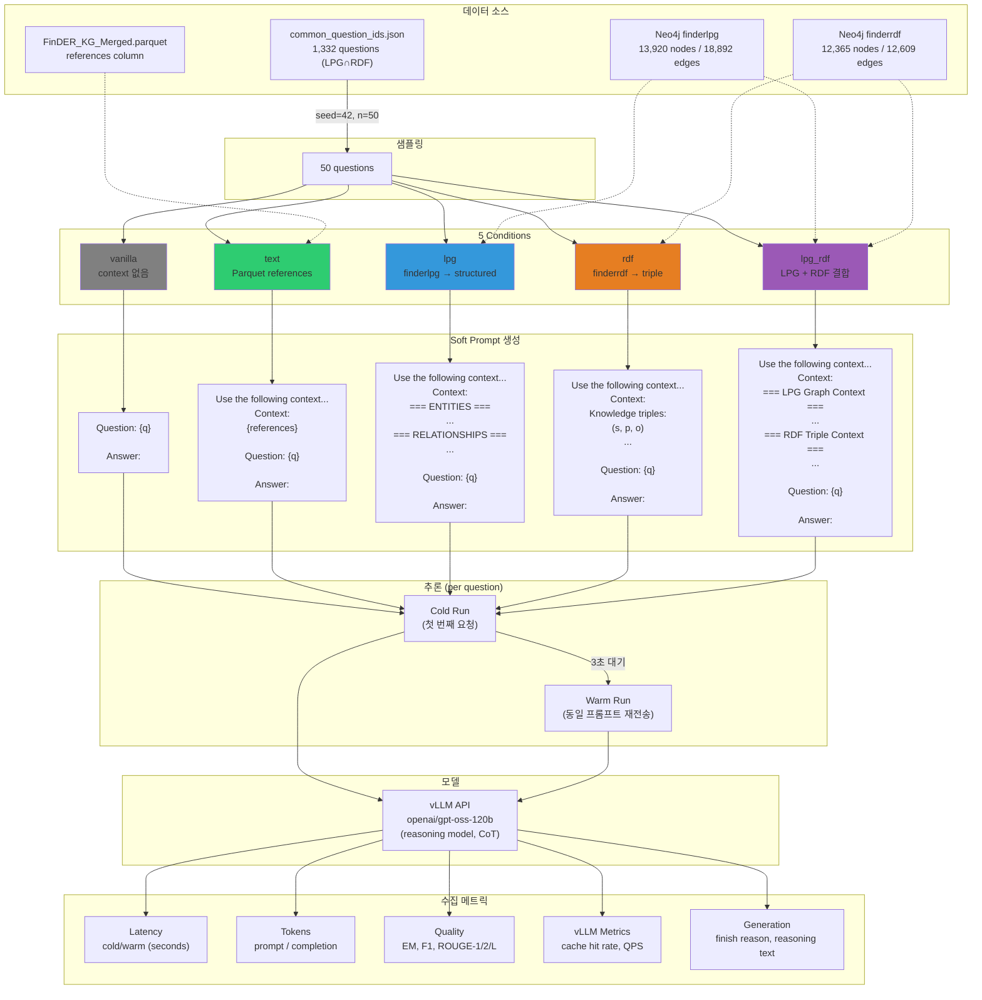
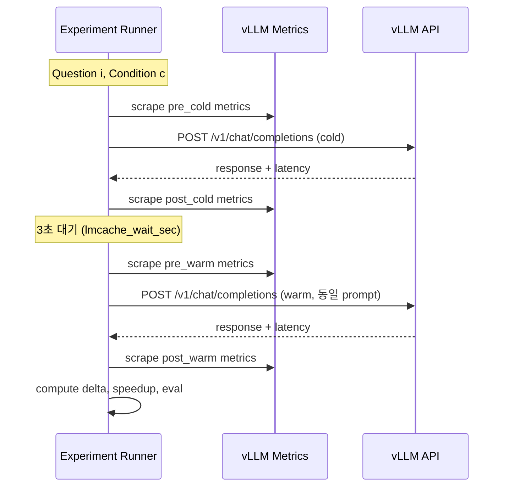
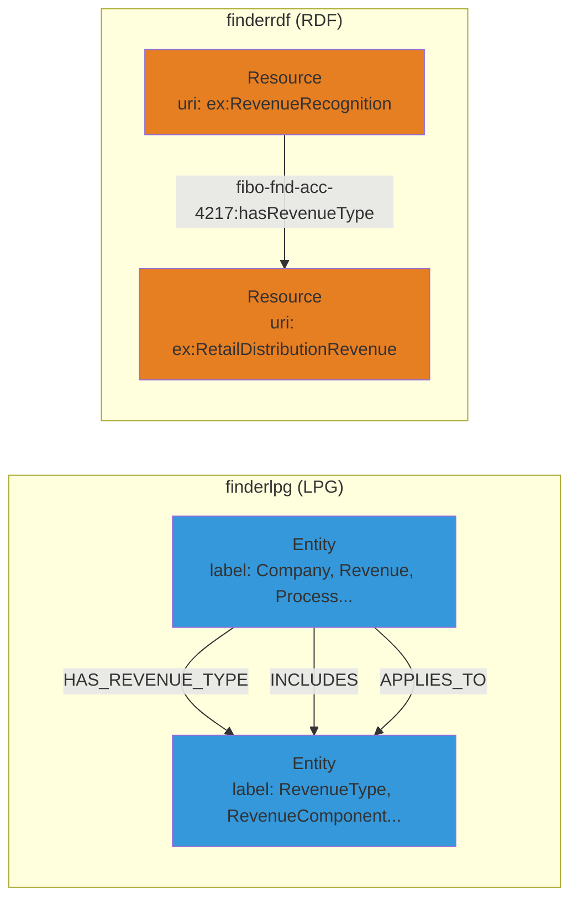
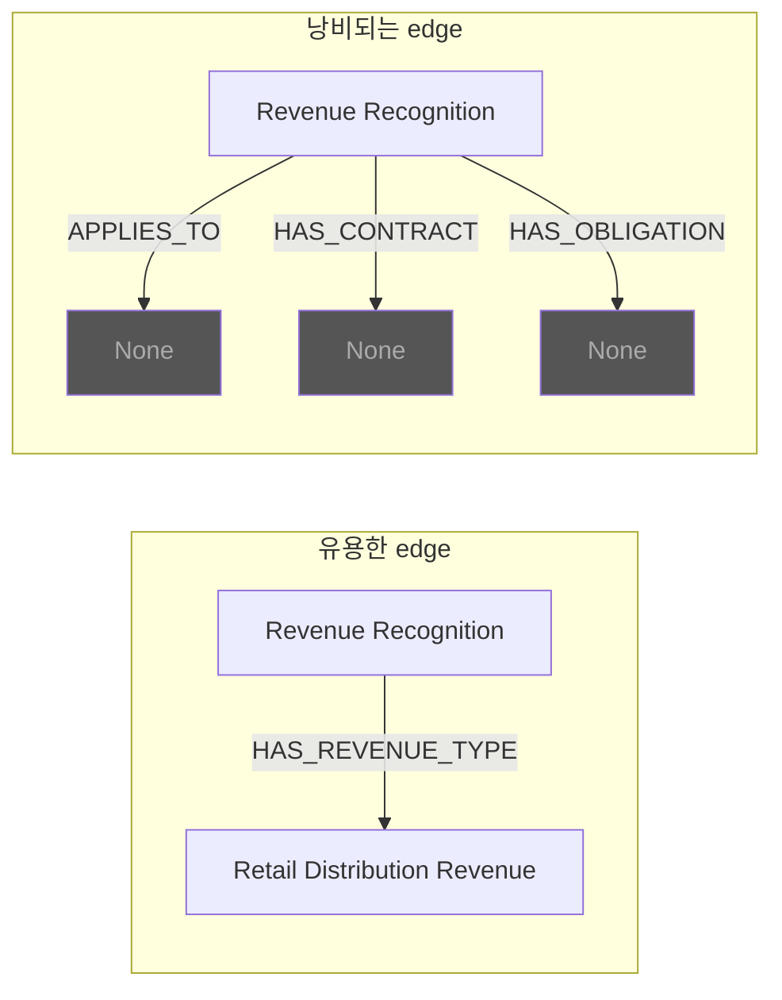
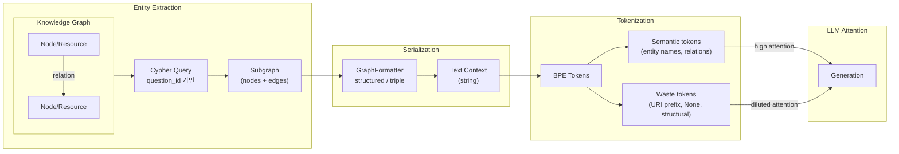
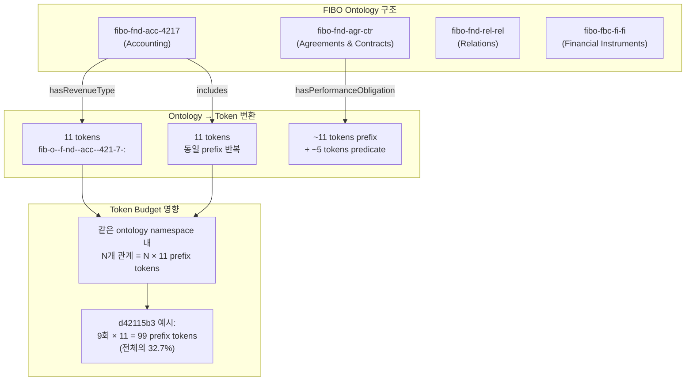
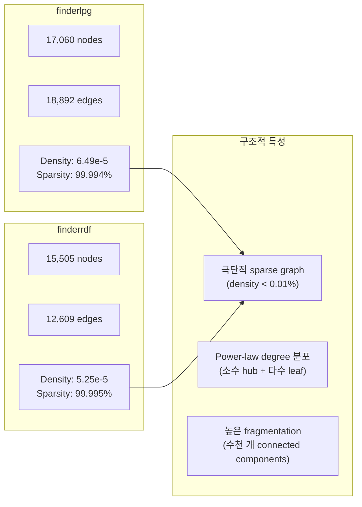
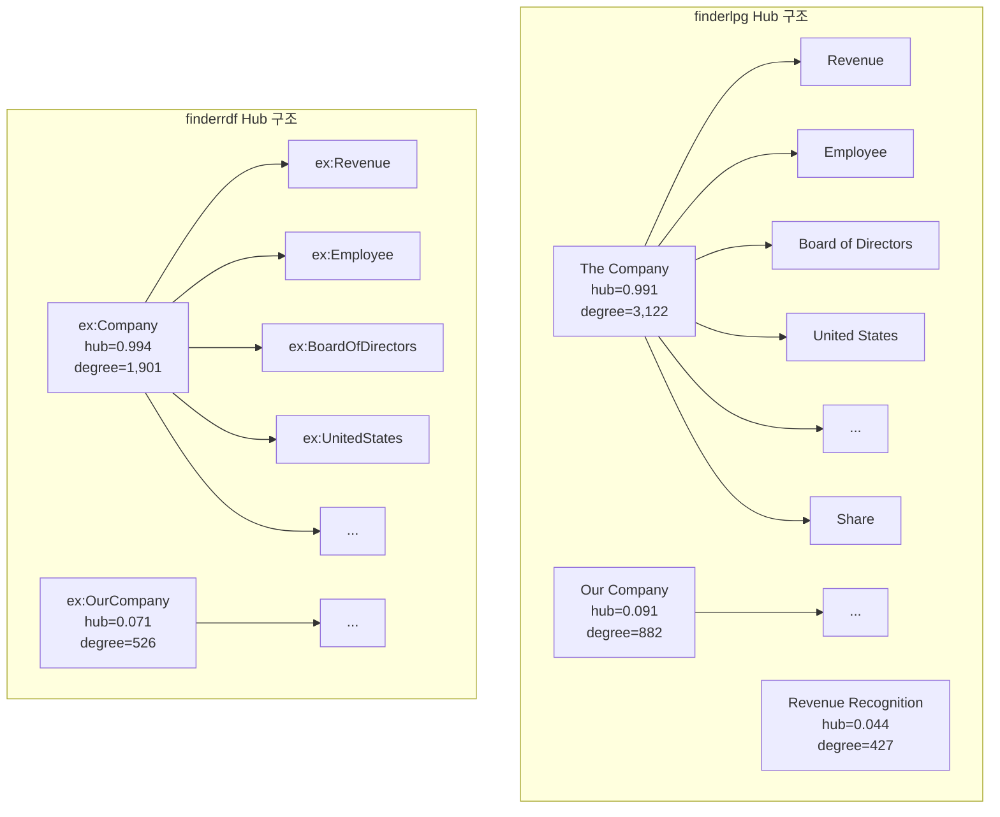

# KV Cache Experiment Analysis

> 실험 결과: `results/kvcache_experiment/20260208_091053/`
> 분석 노트북: `notebooks/kvcache_analysis.ipynb`

## 1. 실험 설계

### 목적

Soft prompt 방식으로 5가지 graph representation을 주입했을 때, LLM 응답 품질과 latency를 비교한다.

### 실험 구조



### Cold/Warm 측정 흐름



### 실험 파라미터

| 파라미터 | 값 |
|----------|-----|
| 모델 | `openai/gpt-oss-120b` (reasoning, CoT 지원) |
| API | vLLM OpenAI-compatible |
| 샘플 수 | 50 questions per condition |
| max_tokens | 512 |
| temperature | 0.0 |
| seed | 42 |
| lmcache_wait_sec | 3.0 |
| inter_question_wait | 1.0 |
| checkpoint_every | 10 |

---

## 2. 조건별 결과 요약

### 2.1 품질 메트릭

| Condition | N | Token F1 | ROUGE-1 | ROUGE-2 | ROUGE-L | EM |
|-----------|---|----------|---------|---------|---------|-----|
| **text** | 50 | **0.189** | **0.376** | **0.096** | **0.181** | 0.0 |
| **lpg** | 50 | 0.163 | 0.311 | 0.064 | 0.149 | 0.0 |
| **lpg_rdf** | 50 | 0.151 | 0.307 | 0.064 | 0.156 | 0.0 |
| **rdf** | 50 | 0.152 | 0.293 | 0.059 | 0.150 | 0.0 |
| **vanilla** | 50 | 0.143 | 0.266 | 0.043 | 0.126 | 0.0 |

### 2.2 Latency 메트릭

| Condition | Cold (s) | Warm (s) | Speedup | Cold Std |
|-----------|----------|----------|---------|----------|
| **lpg** | **6.859** | 6.895 | 1.009 | 2.058 |
| **rdf** | 7.047 | 7.055 | 1.008 | 1.805 |
| **lpg_rdf** | 7.536 | 7.261 | **1.062** | 1.294 |
| **text** | 7.796 | 7.754 | 1.006 | 1.159 |
| **vanilla** | 8.115 | 8.091 | 1.003 | 0.030 |

### 2.3 Context / Token 특성

| Condition | Prompt Tokens | Context (chars) | Completion Tokens | Chars/Token |
|-----------|---------------|-----------------|-------------------|-------------|
| vanilla | 89 | 0 | 512 | — |
| rdf | 295 | 635 | 436 | 2.97 |
| lpg | 339 | 847 | 423 | 3.30 |
| text | 457 | 1,922 | 483 | 5.29 |
| lpg_rdf | 541 | 1,520 | 468 | 3.15 |

### 2.4 Finish Reason 분포

| Condition | stop (완성) | length (절단) |
|-----------|-------------|---------------|
| vanilla | 0% | **100%** |
| lpg | **35%** | 65% |
| rdf | **34%** | 66% |
| text | 16% | 84% |
| lpg_rdf | 26% | 74% |

### 2.5 Reasoning (CoT) 통계

| Condition | CoT 비율 | 평균 길이 (chars) |
|-----------|----------|-------------------|
| vanilla | 100% | 1,134 |
| lpg_rdf | 100% | 1,180 |
| rdf | 100% | 1,061 |
| text | 100% | 913 |
| lpg | 98% | 910 |

### 2.6 KV Cache Prefix Reuse

| 메트릭 | 값 |
|--------|-----|
| gpu_prefix_cache_hit_rate | 0.0 (전 구간) |
| warm_cache_hit_delta | 0.0 |
| warm_cache_queries_delta | 0.0 |

KV cache prefix reuse가 발생하지 않음.

---

## 3. Per-Question 분석

### 3.1 Best Condition 분포 (Token F1 기준, n=49)

| Winner | 횟수 | 비율 |
|--------|------|------|
| text | 25 | 51.0% |
| lpg | 10 | 20.4% |
| lpg_rdf | 5 | 10.2% |
| vanilla | 5 | 10.2% |
| rdf | 4 | 8.2% |

### 3.2 Mean Rank

| Condition | Mean Rank (낮을수록 좋음) |
|-----------|--------------------------|
| text | 1.96 |
| lpg | 2.86 |
| rdf | 3.27 |
| lpg_rdf | 3.31 |
| vanilla | 3.61 |

### 3.3 Graph > Text 빈도

- 49문항 중 **22문항 (45%)** 에서 graph condition이 text를 능가
- LPG가 text를 이긴 경우가 가장 많음

### 3.4 Vanilla 1위 (context가 방해된 경우)

5문항 (10.2%):

| QID | VAN F1 | Best Context F1 | Advantage | Question |
|-----|--------|-----------------|-----------|----------|
| 23e48bf5 | 0.269 | 0.176 (text) | +0.093 | Lennar Corp CAPEX allocation |
| fe8ef015 | 0.262 | 0.205 (rdf) | +0.057 | Quanta Services margin risk |
| 5da21cf3 | 0.230 | 0.190 (text) | +0.040 | SWA fleet modernization |
| d42115b3 | 0.223 | 0.204 (rdf) | +0.019 | AEE revenue accrual |
| da91a4f3 | 0.174 | 0.140 (lpg) | +0.034 | PNR CAPEX breakdown |

### 3.5 Condition 간 F1 격차 (상위 5 high-spread)

| QID | Spread | Best | Worst | Question |
|-----|--------|------|-------|----------|
| 4d1e5449 | 0.249 | text (0.362) | lpg_rdf (0.113) | BXP employee count |
| 0b050b73 | 0.190 | text (0.353) | vanilla (0.163) | Alliant Energy liabilities |
| 60f2347f | 0.154 | text (0.239) | vanilla (0.085) | Home Depot labor cost |
| 74cfc109 | 0.149 | text (0.253) | rdf (0.104) | BD liquidity investing |
| 23d596ce | 0.144 | text (0.207) | lpg_rdf (0.063) | TJX indemnification |

### 3.6 LPG vs RDF Paired 비교 (같은 질문)

| 메트릭 | 값 |
|--------|-----|
| LPG > RDF | 27 questions |
| RDF > LPG | 14 questions |
| Tie (±0.005) | 8 questions |
| Mean delta (LPG-RDF) | +0.0109 |
| Paired t-stat | 2.008 (n=49, 경계적 유의) |

### 3.7 Finish Reason과 품질 관계

| Condition | stop F1 | length F1 | delta |
|-----------|---------|-----------|-------|
| text | **0.254** | 0.177 | **+0.078** |
| rdf | 0.153 | 0.152 | +0.002 |
| lpg | 0.149 | 0.171 | -0.021 |
| lpg_rdf | 0.146 | 0.153 | -0.008 |

text의 stop 응답은 F1=0.254로 매우 높음. LPG의 stop은 "I'm sorry" 거부 패턴 포함.

### 3.8 Context Length vs F1 상관관계

| Condition | Pearson r |
|-----------|-----------|
| lpg | +0.029 |
| lpg_rdf | +0.045 |
| rdf | -0.097 |
| text | -0.186 |

상관 거의 없음. Context 길이보다 관련성(relevance)이 핵심.

### 3.9 Ground Truth Answer 길이와 F1

| 구간 | N | vanilla | text | lpg | rdf | lpg_rdf |
|------|---|---------|------|-----|-----|---------|
| Short (≤153 words) | 25 | 0.152 | **0.197** | 0.162 | 0.161 | 0.159 |
| Long (>153 words) | 24 | 0.135 | **0.182** | 0.164 | 0.143 | 0.143 |

### 3.10 토픽별 Best Condition

| Topic | N | Best | F1 |
|-------|---|------|-----|
| Revenue | 14 | text | 0.184 |
| HR/Labor | 10 | text | 0.212 |
| **CapEx/Investment** | 6 | **lpg** | **0.165** |
| Legal/Risk | 6 | text | 0.231 |
| **Margins/Costs** | 3 | **vanilla** | **0.177** |
| Cybersecurity | 3 | text | 0.185 |

### 3.11 Statistical Tests (Ablation, paired t-test vs vanilla)

| Condition | Mean ΔF1 | p-value | 유의성 |
|-----------|----------|---------|--------|
| text | +0.046 | **<0.001** | 유의 |
| lpg | +0.020 | **0.017** | 유의 |
| rdf | +0.009 | 0.188 | 비유의 |
| lpg_rdf | +0.008 | 0.225 | 비유의 |

Graph vs Text (paired):
- LPG vs Text: ΔF1 = -0.026 (p=0.001)
- RDF vs Text: ΔF1 = -0.037 (p<0.001)
- LPG+RDF vs Text: ΔF1 = -0.038 (p<0.001)

---

## 4. LPG vs RDF 그래프 구조 분석

### 4.1 그래프 스키마 비교



### 4.2 질문당 서브그래프 통계 (5-question sample)

**LPG:**

| QID | Nodes | Edges | Chars | Tokens | Ch/Tok |
|-----|-------|-------|-------|--------|--------|
| d42115b3 | 16 | 39 | 2,412 | 612 | 3.94 |
| 018ff1c9 | 5 | 5 | 345 | 107 | 3.22 |
| 4d1e5449 | 7 | 4 | 332 | 101 | 3.29 |
| b9fc3e0b | 5 | 2 | 231 | 65 | 3.55 |
| 9f4c64ae | 15 | 6 | 554 | 165 | 3.36 |

**RDF:**

| QID | Triples | Chars | Tokens | Ch/Tok | FIBO prefix # |
|-----|---------|-------|--------|--------|---------------|
| d42115b3 | 12 | 984 | 303 | 3.25 | 12 |
| 018ff1c9 | 7 | 512 | 165 | 3.10 | 1 |
| 4d1e5449 | 5 | 302 | 104 | 2.90 | 5 |
| b9fc3e0b | 4 | 329 | 94 | 3.50 | 4 |
| 9f4c64ae | 12 | 1,092 | 304 | 3.59 | 12 |

### 4.3 LPG Context 형태 (d42115b3 실제 데이터)

```
=== ENTITIES ===
[Concept] Alternative Revenue Program
[RevenueType] Electric Transmission Revenue
[RevenueComponent] MEEIA
[RevenueComponent] MISO Revenue
[RevenueType] Off-System Revenue
[RevenueType] Regulatory Recovery Revenue
[RevenueType] Retail Distribution Revenue
[Process] Revenue Recognition
[RevenueComponent] VBA
[RevenueComponent] WNAR
[RevenueComponent] Wholesale Bilateral Revenue
[PerformanceObligation] None
[Price] None
[CustomerContract] None
[BillingFrequency] None
[PaymentDuePeriod] None

=== RELATIONSHIPS ===
Alternative Revenue Program --[HAS_REVENUE_TYPE]--> Regulatory Recovery Revenue
Alternative Revenue Program --[INCLUDES]--> MEEIA
Alternative Revenue Program --[INCLUDES]--> VBA
Alternative Revenue Program --[INCLUDES]--> WNAR
Revenue Recognition --[HAS_REVENUE_TYPE]--> Retail Distribution Revenue
Revenue Recognition --[HAS_REVENUE_TYPE]--> Electric Transmission Revenue
Revenue Recognition --[HAS_REVENUE_TYPE]--> Off-System Revenue
Revenue Recognition --[APPLIES_TO]--> None
Revenue Recognition --[HAS_CONTRACT]--> None
...39 edges total
```

### 4.4 RDF Context 형태 (d42115b3 실제 데이터)

```
Knowledge triples:
(ex:AlternativeRevenueProgram, fibo-fnd-acc-4217:hasRevenueType, ex:RegulatoryRecoveryRevenue)
(ex:AlternativeRevenueProgram, fibo-fnd-acc-4217:includes, ex:MEEIA)
(ex:AlternativeRevenueProgram, fibo-fnd-acc-4217:includes, ex:VBA)
(ex:AlternativeRevenueProgram, fibo-fnd-acc-4217:includes, ex:WNAR)
(ex:CustomerContract, fibo-fnd-agr-ctr:hasPerformanceObligation, ex:PerformanceObligation)
(ex:OffSystemRevenue, fibo-fnd-acc-4217:includes, ex:MISORevenue)
(ex:OffSystemRevenue, fibo-fnd-acc-4217:includes, ex:WholesaleBilateralRevenue)
(ex:PerformanceObligation, fibo-fnd-agr-ctr:hasStandaloneSellingPrice, ex:StandaloneSellingPrice)
(ex:RevenueRecognition, fibo-fnd-acc-4217:hasRevenueType, ex:RetailDistributionRevenue)
(ex:RevenueRecognition, fibo-fnd-acc-4217:hasRevenueType, ex:ElectricTransmissionRevenue)
(ex:RevenueRecognition, fibo-fnd-acc-4217:hasRevenueType, ex:OffSystemRevenue)
(ex:RevenueRecognition, fibo-fnd-rel-rel:hasContract, ex:CustomerContract)
```

---

## 5. Tokenization 분석 (Llama 3.1 BPE)

### 5.1 동일 관계의 토큰 비용

| 관계 | LPG tokens | RDF tokens | 배율 |
|------|-----------|-----------|------|
| RevRec → RetailDistRev | 15 | 26 | 1.73x |
| OffSysRev includes MISO | 14 | 24 | 1.71x |
| AltRevProg includes VBA | 12 | 24 | 2.00x |
| CustContract → PerfObl | 13 | 28 | 2.15x |

### 5.2 Token Category Breakdown (d42115b3)

**LPG (612 tokens):**

| Category | Tokens | 비율 |
|----------|--------|------|
| semantic | 477 | 77.9% |
| none_waste | 51 | 8.3% |
| whitespace | 56 | 9.2% |
| structural | 28 | 4.6% |

**RDF (303 tokens):**

| Category | Tokens | 비율 |
|----------|--------|------|
| semantic | 232 | 76.6% |
| URI prefix | 55 | 18.2% |
| structural | 16 | 5.3% |

### 5.3 URI Prefix 반복 (RDF, d42115b3)

| Prefix | 반복 횟수 | Tokens/회 | 총 소비 |
|--------|----------|-----------|---------|
| `fibo-fnd-acc-4217:` | 9 | 11 | 99 |
| `fibo-fnd-agr-ctr:` | 2 | ~11 | ~22 |
| `fibo-fnd-rel-rel:` | 1 | ~11 | ~11 |
| `ex:` | 24 | 2 | 48 |
| **합계** | — | — | **~175 (57.8%)** |

### 5.4 Effective Token 비교

| QID | LPG total | RDF total | LPG effective (waste 제외) | RDF effective (prefix 제외) |
|-----|-----------|-----------|---------------------------|----------------------------|
| d42115b3 | 612 | 303 | 570 (93%) | 123 (41%) |
| 4d1e5449 | 101 | 104 | 93 (92%) | 29 (28%) |
| b9fc3e0b | 65 | 94 | 56 (86%) | 34 (36%) |

### 5.5 LPG Token Stream 예시 (처음 15 tokens)

```
Idx  Token                      Category
  0  <|begin_of_text|>          —
  1  '==='                      STRUCTURAL (낮은 attention)
  2  ' ENT'                     SEMANTIC (header)
  3  'ITIES'                    SEMANTIC (header)
  4  ' ==='                     STRUCTURAL
  5  '\n'                       WHITESPACE
  6  '['                        STRUCTURAL
  7  'Concept'                  SEMANTIC ← entity label
  8  ']'                        STRUCTURAL
  9  ' Alternative'             SEMANTIC ← entity name (높은 attention)
 10  ' Revenue'                 SEMANTIC ← entity name (높은 attention)
 11  ' Program'                 SEMANTIC ← entity name (높은 attention)
```

### 5.6 RDF Token Stream 예시 (처음 15 tokens)

```
Idx  Token                      Category
  0  <|begin_of_text|>          —
  1  'Knowledge'                STRUCTURAL
  2  ' triples'                 STRUCTURAL
  3  ':\n'                      STRUCTURAL
  4  '(ex'                      PREFIX ← URI noise
  5  ':'                        PREFIX
  6  'Alternative'              SEMANTIC ← entity name
  7  'Revenue'                  SEMANTIC ← entity name
  8  'Program'                  SEMANTIC ← entity name
  9  ','                        STRUCTURAL
 10  ' fib'                     PREFIX ← URI noise 시작
 11  'o'                        PREFIX
 12  '-f'                       PREFIX
 13  'nd'                       PREFIX
 14  '-'                        PREFIX
```

→ RDF의 token index 10~19가 모두 `fibo-fnd-acc-4217:` prefix로 소비됨.

---

## 6. Attention Flow 분석

### 6.1 Attention Density 비교

질문 "AEE's revenue... retail distribution"에 대해:

| Condition | 질문과 매칭되는 토큰 수 | 전체 토큰 | Attention Density |
|-----------|------------------------|-----------|-------------------|
| LPG | 100 | 612 | **16.3%** |
| RDF | 32 | 303 | 10.6% |

LPG가 1.5x 높은 attention density.

### 6.2 Attention 흐름 다이어그램

```mermaid
flowchart LR
    subgraph Question["질문 토큰"]
        Q1["revenue"]
        Q2["retail"]
        Q3["distribution"]
    end

    subgraph LPG_ctx["LPG Context (15 tokens)"]
        L1["Revenue"]
        L2["Recognition"]
        L3["--["]
        L4["HAS_REVENUE_TYPE"]
        L5["]-->"]
        L6["Retail"]
        L7["Distribution"]
        L8["Revenue"]
        style L3 fill:#555,color:#aaa
        style L5 fill:#555,color:#aaa
    end

    subgraph RDF_ctx["RDF Context (26 tokens)"]
        R1["(ex"]
        R2[":"]
        R3["Revenue"]
        R4["Recognition"]
        R5[","]
        R6["fib"]
        R7["o"]
        R8["-f"]
        R9["nd"]
        R10["-"]
        R11["acc"]
        R12["-"]
        R13["421"]
        R14["7"]
        R15[":"]
        R16["has"]
        R17["Revenue"]
        R18["Type"]
        R19[","]
        R20["ex"]
        R21[":"]
        R22["Retail"]
        R23["Distribution"]
        R24["Revenue"]
        R25[")"]
        style R1 fill:#555,color:#aaa
        style R2 fill:#555,color:#aaa
        style R5 fill:#555,color:#aaa
        style R6 fill:#800,color:#faa
        style R7 fill:#800,color:#faa
        style R8 fill:#800,color:#faa
        style R9 fill:#800,color:#faa
        style R10 fill:#800,color:#faa
        style R11 fill:#800,color:#faa
        style R12 fill:#800,color:#faa
        style R13 fill:#800,color:#faa
        style R14 fill:#800,color:#faa
        style R15 fill:#800,color:#faa
        style R19 fill:#555,color:#aaa
        style R20 fill:#555,color:#aaa
        style R21 fill:#555,color:#aaa
        style R25 fill:#555,color:#aaa
    end

    Q1 ==>|"strong"| L1
    Q1 ==>|"strong"| L8
    Q2 ==>|"strong"| L6
    Q3 ==>|"strong"| L7
    Q1 -.->|"weak (diluted)"| R3
    Q1 -.->|"weak"| R17
    Q2 -.->|"weak"| R22
    Q3 -.->|"weak"| R23
```



LPG: 15 tokens 중 **5개 (33%)** 가 high-attention 대상
RDF: 26 tokens 중 **5개 (19%)** 가 high-attention 대상 — 나머지 prefix가 attention mass를 분산

### 6.3 LPG "None" 노드의 Attention 낭비



d42115b3 기준: 39 edges 중 다수가 `→ None` 패턴. 평균 **~10%** 토큰 낭비.

---

## 7. Case Studies

### Case A: Text 최대 이득 (BXP employee, +0.247 F1)

| Condition | F1 | Context | 응답 패턴 |
|-----------|-----|---------|-----------|
| text | **0.362** | references에 "727 non-union, 109 union" 수치 포함 | 정확한 수치 기반 답변 |
| lpg | 0.250 | `[EmployeeGroup] None` 노드만 존재 | "I'm sorry, information not available" |
| rdf | 0.154 | `ex:BXP hasEmployee ex:NonUnionEmployee` | "only mentions non-union employee" |

### Case B: Graph > Text (DG gift card, LPG +0.060)

| Condition | F1 | 응답 패턴 |
|-----------|-----|-----------|
| rdf | **0.261** | triple에서 deferred revenue → gift card liability 관계를 정확히 포착 |
| lpg | 0.258 | structured format이 관계 구조를 명확하게 전달 |
| text | 0.199 | reference 텍스트가 간접적 정보만 포함 |

### Case C: Vanilla 최고 (Lennar CAPEX, +0.093)

| Condition | F1 | 응답 패턴 |
|-----------|-----|-----------|
| vanilla | **0.269** | 사전학습 지식으로 "≈10,200" 추정치 제공 |
| text | 0.176 | reference가 있으나 CAPEX allocation 공식 미포함 |
| lpg | 0.136 | "information not available in provided context" |

---

## 8. Entity Extraction, Linking, Ontology

### 8.1 Entity Extraction → Token Information 파이프라인



### 8.2 Entity Extraction 현황

**LPG (finderlpg)**:
- Cypher: `MATCH (e:Entity) WHERE $qid IN e.question_ids`
- 추출 단위: `Entity` 노드 (label + name 속성)
- 관계: `MATCH (a)-[r]->(b)` (typed relationships)
- 문제: `name="None"` 인 엔티티 다수 포함 → 의미 없는 토큰 생성

**RDF (finderrdf)**:
- Cypher: `MATCH (a:Resource)-[r]->(b:Resource) WHERE r.question_id = $qid`
- 추출 단위: `Resource` 노드 (URI)
- 관계: FIBO ontology-typed edges
- 문제: URI 전체가 노드 식별자로 포함 → prefix 토큰 낭비

### 8.3 Entity Linking 품질과 Token 정보량

| 요소 | LPG 상태 | RDF 상태 | Token 영향 |
|------|----------|----------|-----------|
| Entity 이름 | 자연어 (`Revenue Recognition`) | URI (`ex:RevenueRecognition`) | LPG: 직접 tokenize, RDF: prefix 추가 비용 |
| Entity 타입 | Label (`[RevenueType]`) | `rdf:type` triple 별도 | LPG: 1-2 tokens, RDF: ~15 tokens (triple 전체) |
| 관계 이름 | 영문 (`HAS_REVENUE_TYPE`) | FIBO URI (`fibo-fnd-acc-4217:hasRevenueType`) | LPG: 4-6 tokens, RDF: 15-20 tokens |
| Null 엔티티 | `name="None"` 포함 | 해당 없음 | LPG: ~10% waste |
| URI Prefix | 해당 없음 | 12종 FIBO prefix 반복 | RDF: ~57.8% waste |

### 8.4 Ontology의 역할



**Ontology namespace 분포 (finderrdf 전체)**:

| Namespace | Edge Count | 비율 |
|-----------|-----------|------|
| `fibo-fnd-rel-rel:` | 3,441 | 27.3% |
| `rdf:` | 341 | 2.7% |
| `fibo-fnd-acc-4217:` | 기타 | — |
| `fibo-fbc-fi-fi:` | 기타 | — |

### 8.5 Entity 품질이 F1에 미치는 영향 (실험 데이터)

| Case | Entity 상태 | Token F1 |
|------|------------|----------|
| BXP employee (4d1e5449) — LPG | `[EmployeeGroup] None` → "I'm sorry" 거부 | 0.250 |
| BXP employee (4d1e5449) — RDF | `ex:BXP hasEmployee ex:NonUnionEmployee` | 0.154 |
| BXP employee (4d1e5449) — Text | "727 non-union, 109 union" 수치 포함 | **0.362** |
| AEE revenue (d42115b3) — LPG | 16 nodes, 39 edges (None 포함) | 0.141 |
| AEE revenue (d42115b3) — RDF | 12 triples (FIBO prefix 포함) | 0.182 |
| DG gift card — LPG | 관계 구조가 정확히 매칭 | **0.258** |
| DG gift card — RDF | triple 형태로 정확히 매칭 | **0.261** |

Graph condition이 text를 이기는 45% case는 entity가 질문에 직접 매칭되는 경우에 집중됨.

---

## 9. Graph Analysis

### 9.1 기본 통계

| 메트릭 | finderlpg | finderrdf |
|--------|-----------|-----------|
| Nodes | 17,060 | 15,505 |
| Edges | 18,892 | 12,609 |
| Density | 6.49 × 10⁻⁵ | 5.25 × 10⁻⁵ |
| Avg degree | 2.21 | 1.63 |
| Isolated nodes (degree=0) | 3,765 (22.1%) | 5,802 (37.4%) |

### 9.2 Degree Distribution

**finderlpg:**

| 통계 | In-degree | Out-degree | Total degree |
|------|-----------|------------|--------------|
| Min | 0 | 0 | 0 |
| Max | 260 | 2,919 | 3,122 |
| Mean | 1.11 | 1.11 | 2.21 |
| Median | 1.0 | 0.0 | 1.0 |
| Std | 3.97 | 23.77 | 25.89 |
| p90 | 2 | 2 | 4 |
| p95 | 3 | 4 | 6 |
| p99 | 9 | 13 | 18 |

**finderrdf:**

| 통계 | In-degree | Out-degree | Total degree |
|------|-----------|------------|--------------|
| Min | 0 | 0 | 0 |
| Max | 195 | 1,874 | 1,901 |
| Mean | 0.81 | 0.81 | 1.63 |
| Median | 1.0 | 0.0 | 1.0 |
| Std | 2.81 | 16.31 | 16.95 |
| p90 | 1 | 1 | 3 |
| p95 | 2 | 3 | 5 |
| p99 | 7 | 10 | 15 |

**Degree 분포 (buckets):**

| Bucket | finderlpg | finderrdf |
|--------|-----------|-----------|
| 0 | 3,765 | 5,802 |
| 1-2 | 10,783 | 8,065 |
| 3-5 | 1,524 | 1,034 |
| 6-10 | 609 | 365 |
| 11-20 | 238 | 151 |
| 21-50 | 102 | 64 |
| 51+ | 39 | 24 |

### 9.3 Sparsity 분석



### 9.4 Connected Components

| 메트릭 | finderlpg | finderrdf |
|--------|-----------|-----------|
| Component 수 | 4,503 | 6,482 |
| 최대 component | 10,749 (63.0%) | 7,548 (48.7%) |
| 2nd largest | 21 | 36 |
| Singleton 수 | 3,768 | 5,805 |
| Reachability (500 pair sampling) | 500/1,234 (40.5%) | 461/2,000 (23.1%) |

### 9.5 PageRank (Top 20)

**finderlpg:**

| Rank | Score | Node |
|------|-------|------|
| 1 | 0.011456 | [Entity] The Company |
| 2 | 0.004885 | [Entity] United States |
| 3 | 0.003000 | [Entity] Company |
| 4 | 0.002956 | [Entity] Board of Directors |
| 5 | 0.001761 | [Entity] Audit Committee |
| 6 | 0.001598 | [Entity] Chief Executive Officer |
| 7 | 0.001555 | [Entity] SEC |
| 8 | 0.001537 | [Entity] Revenue |
| 9 | 0.001401 | [Entity] Share |
| 10 | 0.001369 | [Entity] Employee |
| 11 | 0.001288 | [Entity] Income Tax |
| 12 | 0.001262 | [Entity] Operating Lease |
| 13 | 0.001175 | [Entity] Long-Term Debt |
| 14 | 0.001073 | [Entity] Pension Plan |
| 15 | 0.001070 | [Entity] Annual |
| 16 | 0.001051 | [Entity] Intangible Asset |
| 17 | 0.001045 | [Entity] Goodwill |
| 18 | 0.001044 | [Entity] None |
| 19 | 0.001032 | [Entity] Common Stock |
| 20 | 0.001021 | [Entity] Revenue Recognition |

**finderrdf:**

| Rank | Score | Node |
|------|-------|------|
| 1 | 0.006674 | fibo-fbc-fi-fi:Share |
| 2 | 0.003150 | ex:UnitedStates |
| 3 | 0.001893 | fibo-fbc-fi-fi:DebtInstrument |
| 4 | 0.001459 | fibo-fbc-fi-fi:Bond |
| 5 | 0.001414 | ex:PerformanceObligation |
| 6 | 0.001291 | ex:SEC |
| 7 | 0.001291 | ex:Revenue |
| 8 | 0.001104 | fibo-fbc-fi-fi:CommonStock |
| 9 | 0.001067 | ex:Employee |
| 10 | 0.001020 | ex:OperatingLease |
| 11 | 0.000996 | fibo-fnd-law-lcap:LimitedPartnership |
| 12 | 0.000934 | ex:RevenueRecognition |
| 13 | 0.000910 | ex:LongTermDebt |
| 14 | 0.000873 | ex:IntangibleAsset |
| 15 | 0.000858 | ex:IncomeTax |
| 16 | 0.000852 | fibo-fnd-acc-4217:Goodwill |
| 17 | 0.000800 | ex:AuditCommittee |
| 18 | 0.000778 | ex:BoardOfDirectors |
| 19 | 0.000698 | ex:TradeReceivable |
| 20 | 0.000667 | ex:CashAndCashEquivalents |

### 9.6 HITS (Hub / Authority)

**finderlpg — Top 10 Authorities:**

| Score | Node |
|-------|------|
| 0.480362 | [Entity] None |
| 0.269350 | [Entity] United States |
| 0.218283 | [Entity] Board of Directors |
| 0.178549 | [Entity] Audit Committee |
| 0.174775 | [Entity] Common Stock |
| 0.166866 | [Entity] Revenue |
| 0.164553 | [Entity] SEC |
| 0.163893 | [Entity] Employee |
| 0.159076 | [Entity] Share |
| 0.148839 | [Entity] Income Tax |

**finderlpg — Top 10 Hubs:**

| Score | Node |
|-------|------|
| 0.991208 | [Entity] The Company |
| 0.090660 | [Entity] Our Company |
| 0.043937 | [Entity] Revenue Recognition |
| 0.031432 | [Entity] Net Revenue |
| 0.029001 | [Entity] Total Revenue |
| 0.023750 | [Entity] Operating Segment |
| 0.023012 | [Entity] Financial Statement |
| 0.022399 | [Entity] Compensation Plan |
| 0.020684 | [Entity] Tax |
| 0.020502 | [Entity] Stock Option |

**finderrdf — Top 10 Authorities:**

| Score | Node |
|-------|------|
| 0.568233 | ex:Employee |
| 0.225270 | ex:UnitedStates |
| 0.213440 | ex:Revenue |
| 0.169395 | fibo-fbc-fi-fi:Share |
| 0.160779 | ex:BoardOfDirectors |
| 0.152279 | ex:AuditCommittee |
| 0.150858 | ex:SEC |
| 0.143456 | fibo-fbc-fi-fi:CommonStock |
| 0.130139 | ex:IncomeTax |
| 0.120505 | ex:OperatingLease |

**finderrdf — Top 10 Hubs:**

| Score | Node |
|-------|------|
| 0.994154 | ex:Company |
| 0.071403 | ex:OurCompany |
| 0.046637 | ex:RevenueRecognition |
| 0.024780 | ex:NetRevenue |
| 0.023704 | ex:TotalRevenue |
| 0.020990 | ex:OperatingSegment |
| 0.019929 | fibo-fnd-rel-rel:FinancialStatement |
| 0.018735 | ex:CompensationPlan |
| 0.017913 | ex:StockOption |
| 0.016750 | ex:Tax |

### 9.7 Hub 지배 구조



Hub score 비율: 1위 / 2위 = LPG 10.9x, RDF 13.9x — 양쪽 모두 극단적 single-hub 구조.

### 9.8 Betweenness Centrality (Top 10)

**finderlpg:**

| Score | Node |
|-------|------|
| 0.276479 | [Entity] The Company |
| 0.078111 | [Entity] Our Company |
| 0.042518 | [Entity] United States |
| 0.017999 | [Entity] Revenue Recognition |
| 0.010878 | [Entity] None |
| 0.009927 | [Entity] Net Revenue |
| 0.009912 | [Entity] Annual |
| 0.007539 | [Entity] Total Revenue |
| 0.006822 | [Entity] Operating Segment |
| 0.006305 | [Entity] Board of Directors |

**finderrdf:**

| Score | Node |
|-------|------|
| 0.192673 | ex:Company |
| 0.048520 | ex:OurCompany |
| 0.028579 | ex:RevenueRecognition |
| 0.011044 | ex:UnitedStates |
| 0.008006 | ex:NetRevenue |
| 0.007281 | ex:OperatingSegment |
| 0.006920 | ex:TotalRevenue |
| 0.005637 | ex:BoardOfDirectors |
| 0.005503 | fibo-fnd-rel-rel:FinancialStatement |
| 0.005218 | ex:Tax |

### 9.9 Clustering Coefficient

| 메트릭 | finderlpg | finderrdf |
|--------|-----------|-----------|
| Average local CC (sampled 1,000 nodes) | 0.0496 | 0.0562 |

### 9.10 Path Length

| 메트릭 | finderlpg | finderrdf |
|--------|-----------|-----------|
| Average path length | 4.81 | 4.97 |
| Median path length | 5.0 | 5.0 |
| Diameter estimate | 13 | 11 |

### 9.11 Node Label 분포

**finderlpg (top 10):**

| Label | Count |
|-------|-------|
| Entity | 13,920 |
| Question | 3,140 |
| LegalEntity | 1,974 |
| Company | 588 |
| Competitor | 421 |
| Person | 409 |
| Share | 390 |
| Revenue | 379 |
| Process | 347 |
| Document | 311 |

**finderrdf:**

| Label | Count |
|-------|-------|
| Resource | 12,365 |
| Question | 3,140 |

### 9.12 Relationship Type 분포 (Top 15)

**finderlpg:**

| Type | Count |
|------|-------|
| COMPETES_WITH | 2,229 |
| INCLUDES | 1,358 |
| INVOLVES | 247 |
| EMPLOYS | 208 |
| isDomiciledIn | 199 |
| HAS_REVENUE_TYPE | 195 |
| CARRIES | 188 |
| HAS_RISK_FACTOR | 181 |
| HAS_SUBSIDIARY | 181 |
| REQUIRES | 174 |
| OPERATES_IN | 173 |
| MANAGES | 167 |
| HAS_LEASE | 154 |
| HAS_DEBT | 136 |
| HAS_EQUITY | 130 |

**finderrdf:**

| Type | Count |
|------|-------|
| fibo-fnd-rel-rel:competesWith | 986 |
| fibo-fnd-rel-rel:includes | 581 |
| rdf:type | 341 |
| fibo-fnd-rel-rel:hasCompetitor | 198 |
| fibo-fnd-rel-rel:involves | 180 |
| fibo-fnd-rel-rel:employs | 180 |
| fibo-fnd-plc-loc:isDomiciledIn | 119 |
| fibo-fnd-acc-4217:hasRevenueType | 101 |
| fibo-fnd-acc-4217:carries | 87 |
| fibo-fnd-rel-rel:requires | 86 |
| fibo-fnd-acc-4217:hasRiskFactor | 81 |
| fibo-fnd-oac-own:hasSubsidiary | 78 |
| fibo-fnd-rel-rel:manages | 76 |
| fibo-fnd-rel-rel:operatesIn | 71 |
| fibo-fnd-rel-rel:hasLease | 65 |

---

## 10. 차트 목록

`results/kvcache_experiment/20260208_091053/` 에 저장된 차트:

| File | Section | 내용 |
|------|---------|------|
| `fig2_latency.png` | Latency Analysis | Cold/Warm latency, speedup distribution, latency vs context length |
| `fig3_context.png` | Context Characteristics | Context length, prompt tokens, tokenization efficiency |
| `fig4_quality.png` | Answer Quality | Token F1, ROUGE-L, Substring Match by condition |
| `fig5_pareto.png` | Quality-Latency Tradeoff | Bubble chart (prompt tokens = size) |
| `fig6_completion.png` | Generation Behavior | Completion tokens, finish reason distribution |
| `fig7_ablation.png` | Ablation Study | Paired F1 gain, cache speedup by context length, quality vs token budget |
| `fig9_reasoning.png` | Reasoning Behavior | Latency distribution (violin), latency by finish reason |
| `fig10_heatmap.png` | Per-Question Speedup | Heatmap (green=cache helping, red=miss) |
| `fig11_radar.png` | Multi-Metric Comparison | Normalized radar chart (5 axes) |
